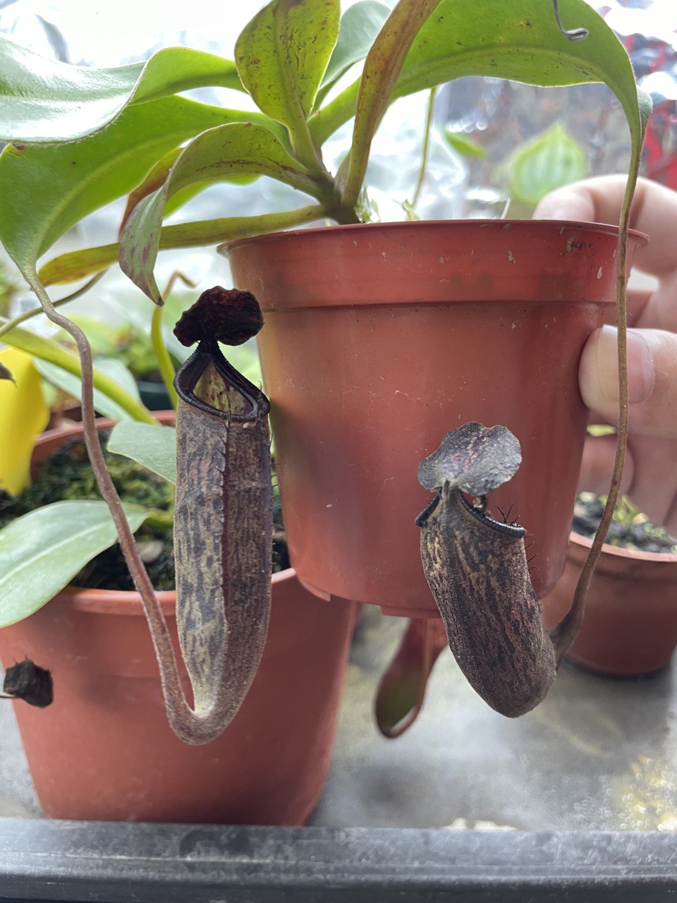
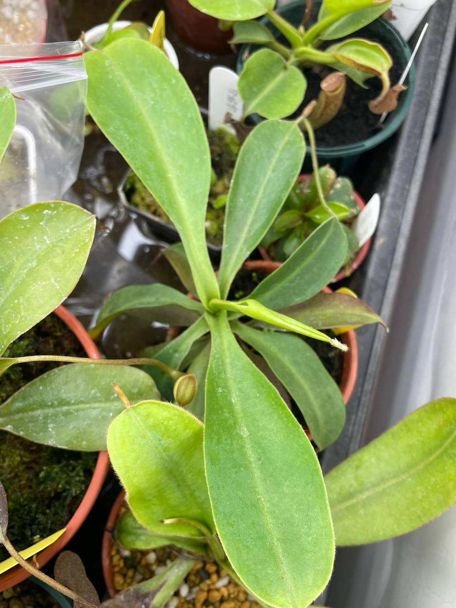
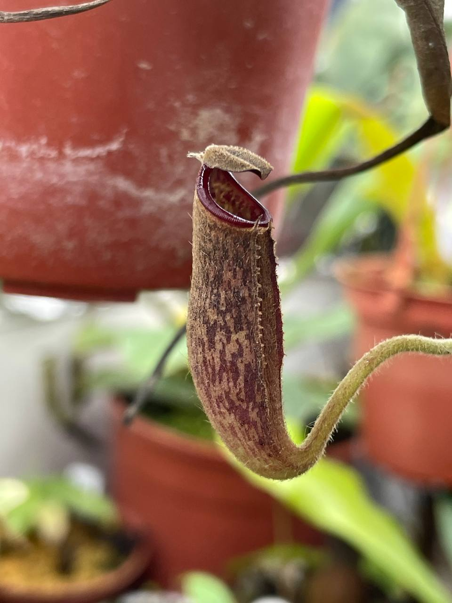
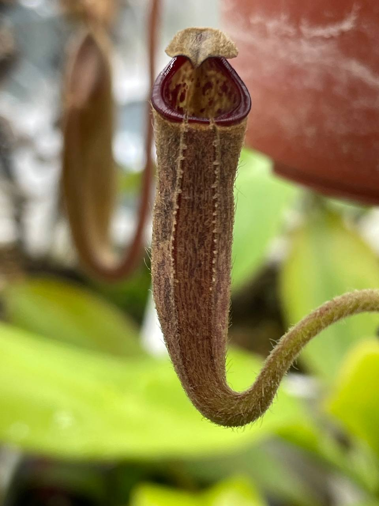
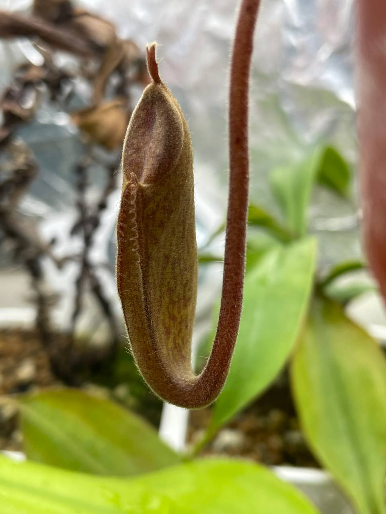
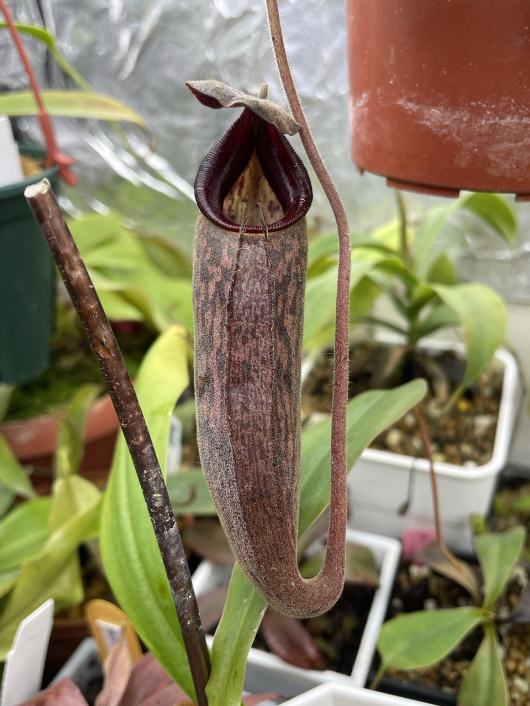
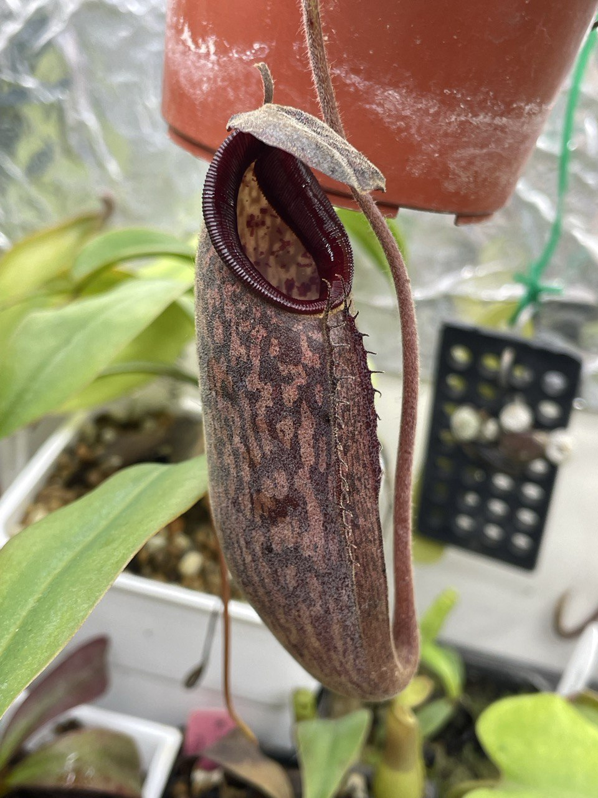

## 有腺包希交寶琳豬籠草

中文名稱：有腺包希交寶琳豬籠草  
學名：*Nepenthes* (*glandulifera* x *boschiana*) x "Lady Pauline"  
購入管道：建國花市  
購入價格：500 NTD  

寶琳為大豬與塔藍山的交種。  
交上包希後整體變成黑色調，蠻喜歡這個色彩的。  

### 2023/08/12 入手


  
  


### 2023/11/07

持續跳葉，但無法結瓶，應該是濕度不夠。  

### 2024/02/02

前兩張是環境變化，結瓶到一半就不再變大的畸形瓶。  
第三張是穩定濕度下結到一半的瓶子，實際大小是畸形瓶的兩倍。  


  
  
  


### 2024/02/21 第一個瓶子

在濕度較高的地方終於結了第一個正常瓶，唇比剛買來的時候寬。  
手感有點像絨布，瓶身有一點糖蜜。  


  
  

