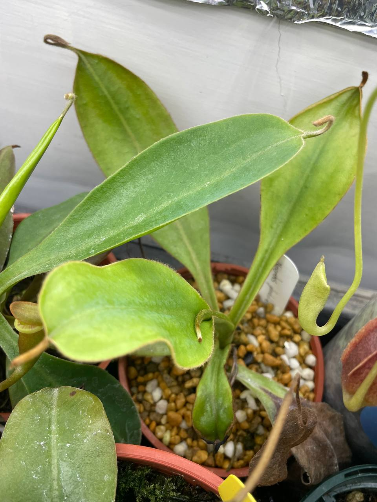

## 有腺豹班豬籠草

中文名稱：有腺豹班豬籠草  
學名：*Nepenthes glandulifera* x *burbidgeae*  
購入管道：FB 食蟲社團  
購入價格：1000 NTD  

### 2023/11/07

07/30 左右入手，無根現切枝條。  
長第一片葉時沒有完全悶養，結果產生頂端焦枯的畸形葉。  
後來套袋悶養長出與原本相同大小的葉片。  
目前確定已發根，已經移出袋子培養。  

