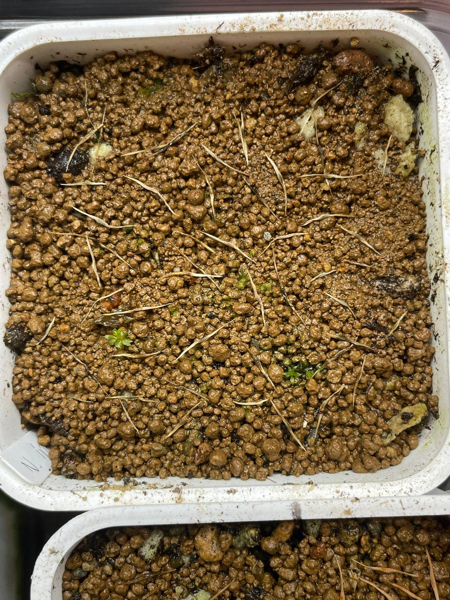

## 植物資料

中文名稱：無刺豬籠草  
學名及產地：*Nepenthes inermis*  
購入管道：FB 台灣食蟲社團  
購入價格：300 NTD/10 顆種子，有標注是來自 Mt. Talang、第二批 500 NTD/20 顆種子  

無刺有特色的是無唇、大口且具有濃稠黏液的上位瓶。  
分佈海拔 1500-2600m，妥妥的高地種，在台灣平地夏天需要放冰箱。  
均溫 24℃ 應該就能種好，日溫越高則需要越低的夜溫。  

## 栽培紀錄

### 2023/12/01 第一批播種

播種後淺腰水（約 1 cm），置於塑膠箱中悶養。  

### 2024/01/05 第二批播種

第一批開始發黑、發霉，沒有任何一顆種子發芽。  
第二批播在同一盆，再嘗試看看。  
同樣置於塑膠箱悶養，目前日/夜溫約 20/18℃。  

