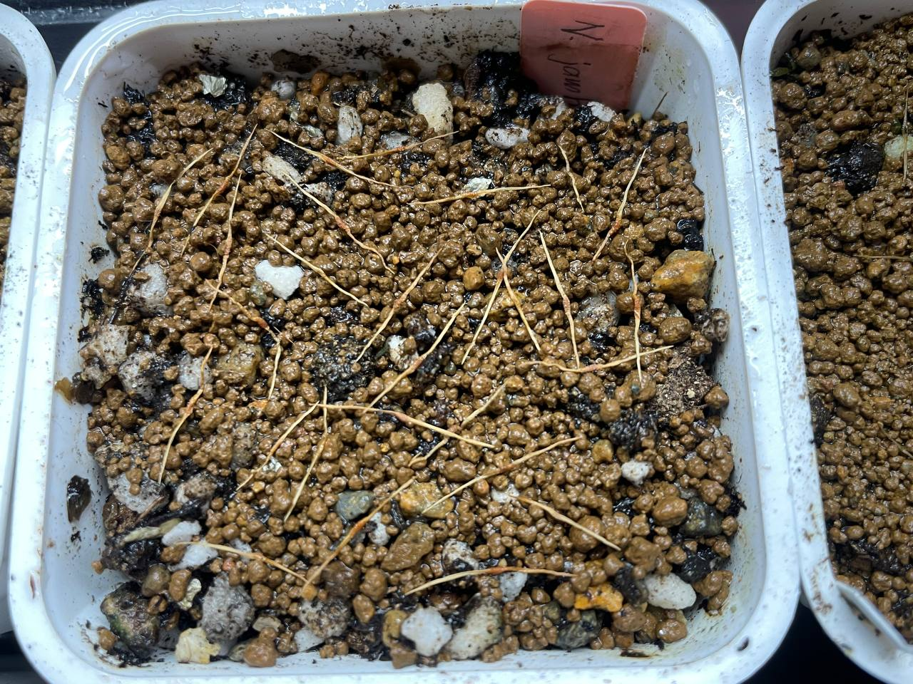
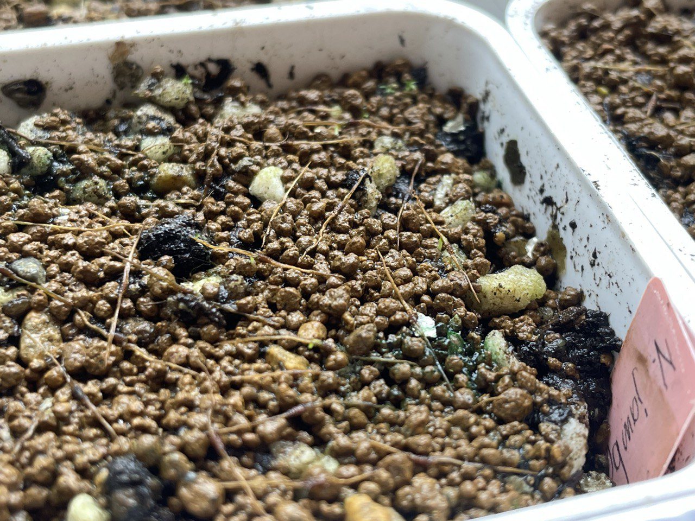
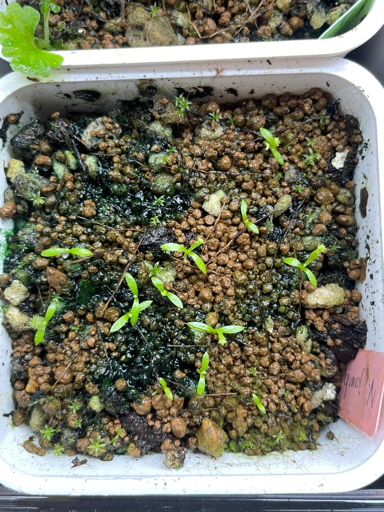

## 植物資料

中文名稱：馬桶豬籠草  
學名：*Nepenthes jamban*  
購入管道：FB 台灣食蟲社團  
購入價格：400 NTD/20 顆種子  

個人非常喜歡的高地豬籠草。  
馬桶狀的瓶子、黏黏的口水、紅色的外觀十分討喜。  
單純是想要把更多不同表現的馬桶，養成馬桶叢林所以來嘗試播種。  

> 馬桶小苗的栽培紀錄：
> 

## 栽培紀錄

### 2024/01/05 播種

置於塑膠箱悶養中，目前日/夜溫約 20/18℃。  

### 2024/02/24 發芽

看到四棵種子的下胚軸伸出來了。  

### 2024/04/10 長真葉

開始長帶有籠蔓的真葉。  

