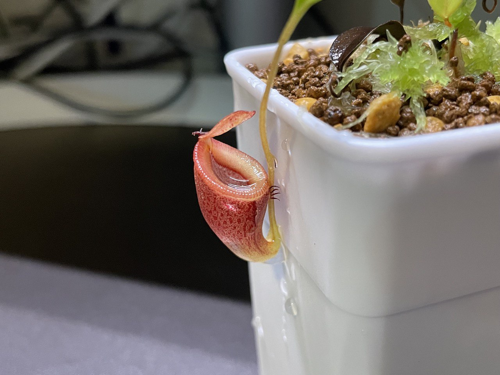
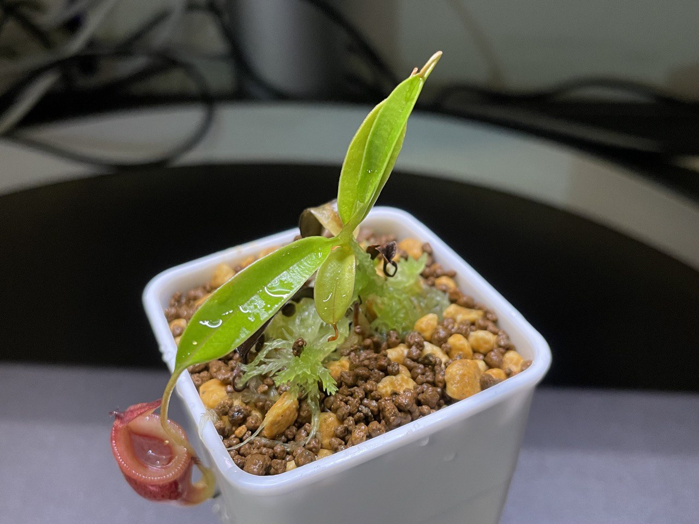
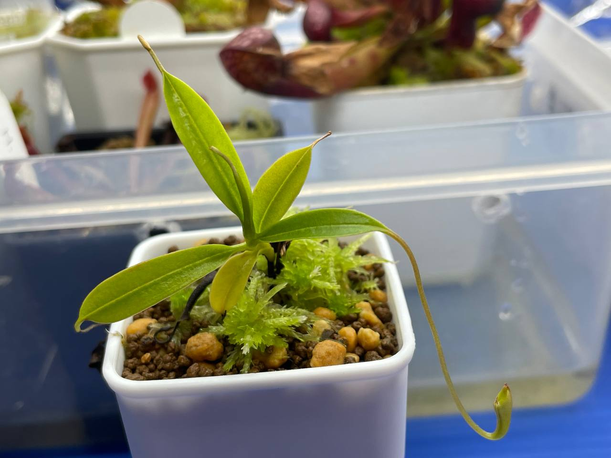
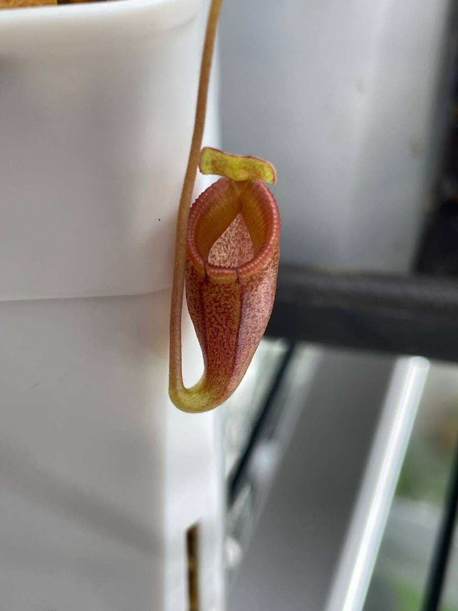
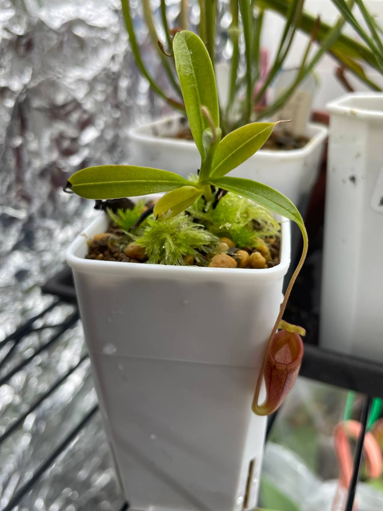

## 植物資料

中文名稱：馬桶豬籠草  
學名：*Nepenthes jamban*  
購入管道：台灣食蟲社團  
購入價格：2500 NTD

日/夜溫：26/23℃，使用製冷晶片小冰箱  
濕度：70% 以上

關於溫度，賣家是以恆溫 25℃ 種植。  
不過網路上有看到許多說法。  
像是一定要日夜溫差，且日/夜溫需要在 24-30/10-16℃；  
或是單純說日夜溫可以在 28-30/20-25℃ 的區間。

## 栽培紀錄

### 2023/08/21 入手

馬桶豬籠草分佈在高山的頂峰灌木叢中，因此猜測白天能忍受強日曬造成的暫時性高溫，只要晚上溫度夠低讓它能夠回復狀態應該不至於熱衰竭死亡。  
於是決定先放入小冰箱光內最強的地方觀察。


  
  


### 2023/10/01 葉片 +1

調整植物位置時壓破原本的瓶子，導致瓶子快速枯萎。  
不過生長勢不錯，剛搬來就能一個月一片葉子。  
新的葉子也正在結瓶中，環境應該算挺適合的。  

### 2023/11/01 入手後第一瓶

結瓶速度極慢，兩個月才結好一個瓶子。  
生長速度說慢不慢，猶豫是否移到較低光的環境加快生長速度。  


  
  

