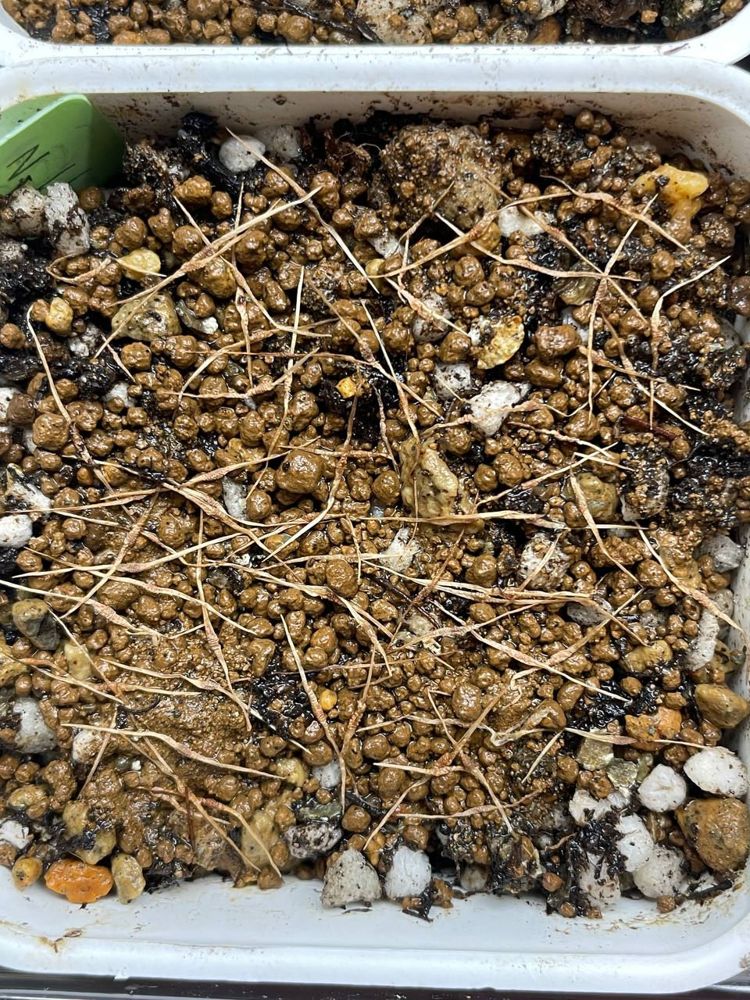

## 植物資料

中文名稱：黑克羅斯豬籠草  
學名及描述：*Nepenthes klossii* black  
購入管道：FB 台灣食蟲社團  
購入價格：1000 NTD/20 顆種子  

瓶子類似於馬兜鈴豬籠草，開口在側邊。  
整體體型比馬兜鈴豬籠草還大。  
葉柄大小似乎是可區分兩者的特徵，克羅斯的葉柄會大很多。  
屬於高地豬籠草，夏天需要降溫。  

## 栽培紀錄

### 2024/01/05 播種

賣家說是黑克羅斯，提供的照片看起來蠻黑的，但種源不明，加減種看看。  
雖然說是 20 顆種子，但有多寄，總共約 40 顆左右。  
置於塑膠箱內悶養中，目前日/夜溫約 20/18℃。  

