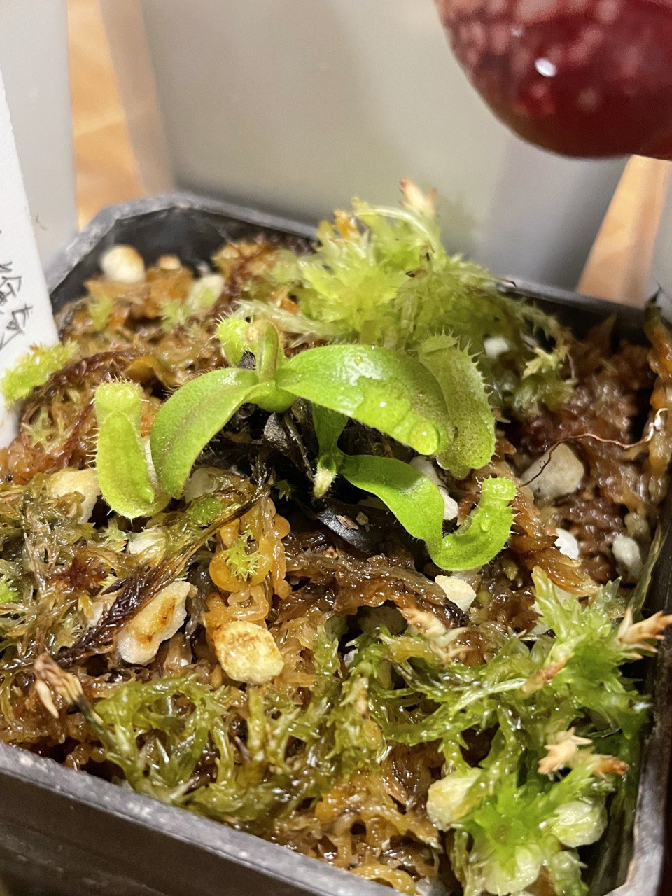
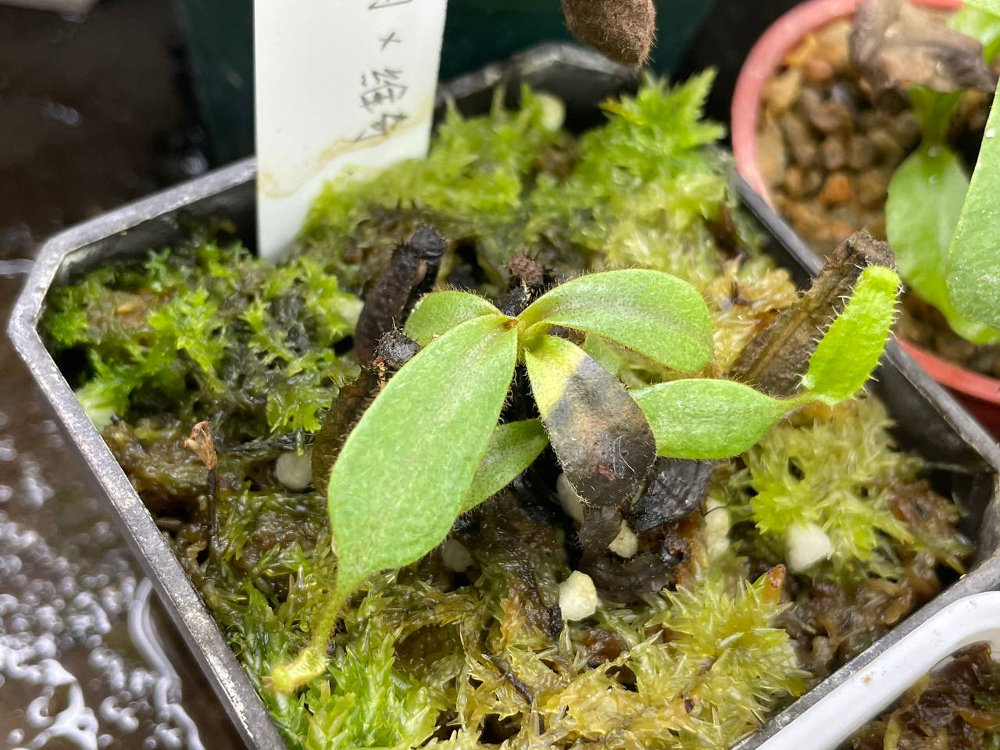

## (勞維豹) x 維奇豬籠草

中文名稱：(勞維豹) x 維奇豬籠草  
學名：*Nepenthes* (*lowii* x *veitchii* x *burbidgeae*) x *veitchii*  
購入管道：FB 食蟲社團  
購入價格：500 NTD  

### 2023/08/07

07/07 左右入手，收到後暫時種植在小冰箱。  
溫差大時葉脈中間會有紅色脈紋。  

### 2023/11/06

十月左右移出冰箱。  
紅色脈紋逐漸消失，下位葉片快速枯萎。  
上位葉片還算正常，繼續放在無套袋的環境觀察。  

