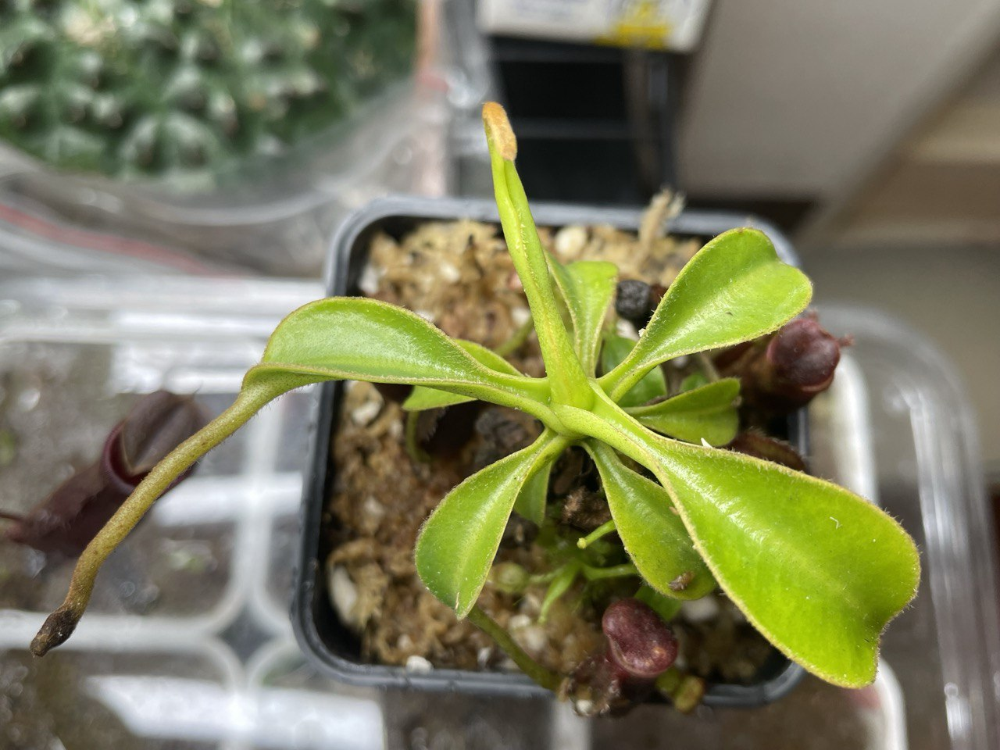
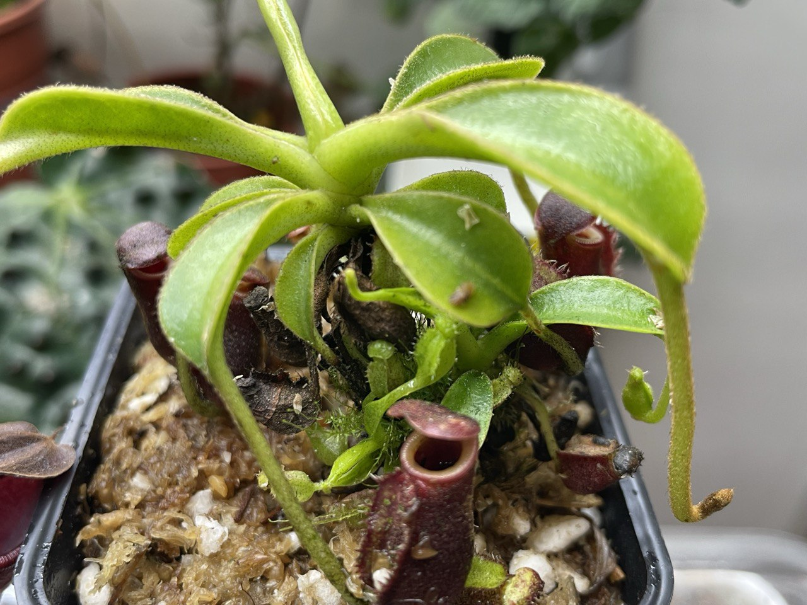
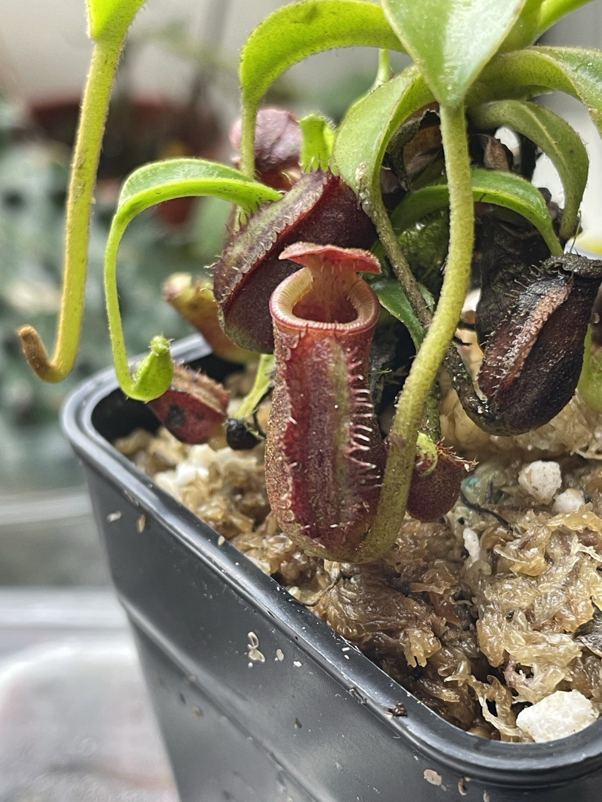

## 植物資料



中文名稱：勞氏豬籠草  
學名：*Nepenthes lowii*  
購入管道：蝦皮，XD蝕驗室  
購入價格：2000 NTD  

## 栽培紀錄

### 2024/01/21 入手

一主芽帶著兩個側芽。  
主芽差不多是亞成瓶。目前還沒觀察到鮮豔的花唇，不過籠蓋下表面可見些許毛鬚。  
兩個側芽則還在幼幼瓶。  

目前套袋室內燈養中，日夜溫約 22/18℃ 左右。  


  
  
  

