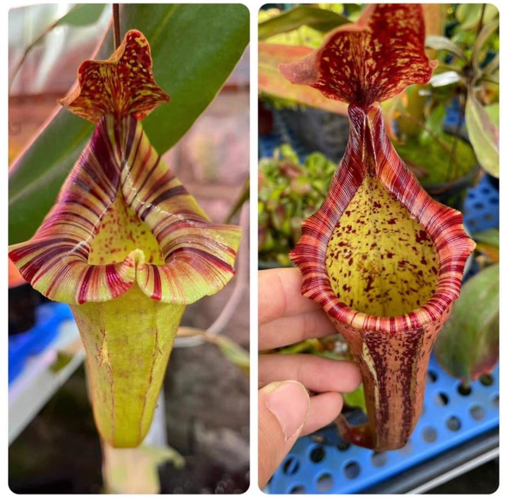
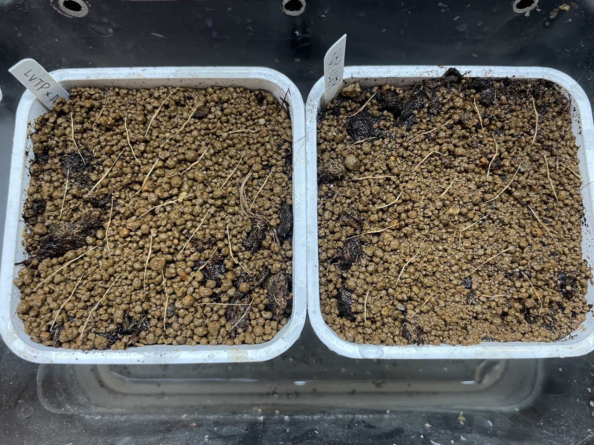
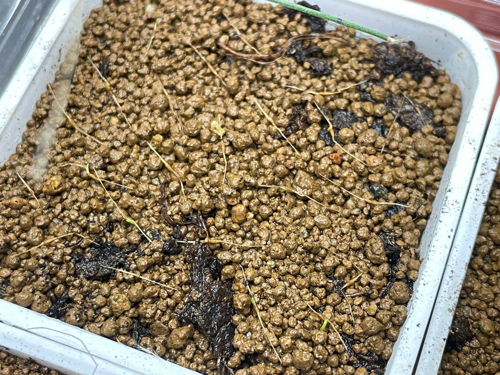
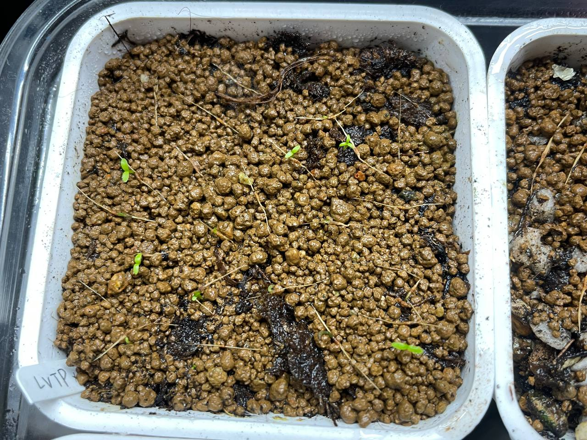
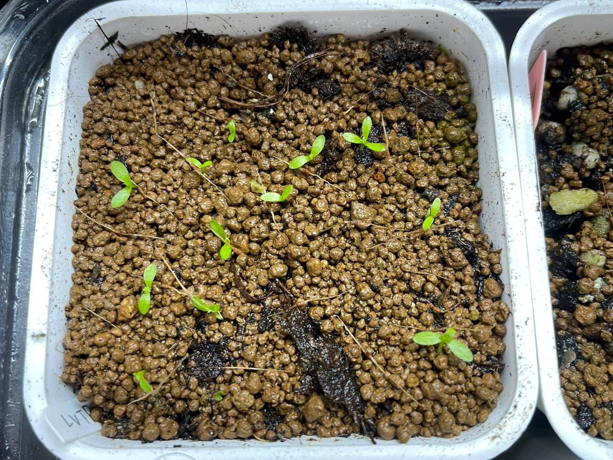

## 植物資料

中文名稱：[(勞氏維奇) x (大豬維奇) x 寬唇] x {{大豬 x [(窄葉勞氏) x (六甲維奇)]} x [(勞氏維奇) x 包希]}  
學名交配式：*Nepenthes* [(*lowii* x *veitchii*) x 'Tiveyi' x *platychila*] x {{*maxima* x [(*stenophylla* x *lowii*) x ('Rokko' x *veitchii*)]} x [(*lowii* x *veitchii*) x *boschiana*]}  
購入管道：FB 食蟲社團  
購入價格：350 NTD/20 顆種子  

交配式中的 MSLRV 與 LVB 實際親本都有點不確定。  

MSLRV 賣家給的學名是，大豬「**匙葉(spathulata)**」勞氏六甲維奇。  
而我在網路上搜尋到的 MSLRV 交配式全都是大豬「**窄葉(stenophylla)**」勞氏六甲維奇。  
我和別的賣家購入的 VBMSLRV 也是有 MSLRV 的交配式，賣家給的則是大豬「**窄葉**」勞氏六甲維奇。  
於是決定在我這改註記為窄葉。  

LVB 賣家只說 B 是 boschiana。  
而常見的 LVB 中的 V 可能是 veitchii 或 ventricosa。  
但比較常看到 veitchii 版本的 LVB 拿去做交種，於是先註記為 veitchii。  

看上母本花寬唇與父本大口的特徵，希望子代能結合兩者優點。  

## 栽培紀錄

### 2023/11/22 播種

播種後淺腰水（約 1 cm），至於塑膠箱中悶養。  

### 2023/12/25 發芽

目前日/夜溫約在 20℃ 左右，可觀察到七棵發芽。  

### 2024/01/02

目前日/夜溫為 22℃/18℃。  

### 2024/02/02 長真葉

目前 12 棵，發芽率不錯。  
12 月底發芽的那批已經開始長真葉。  

