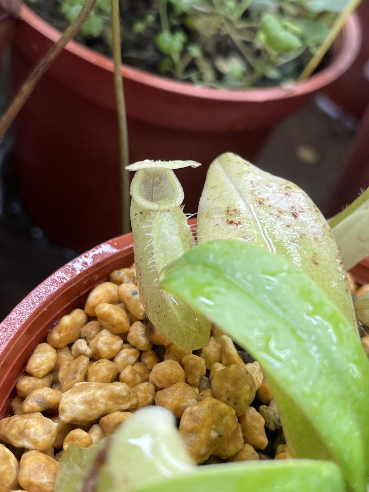
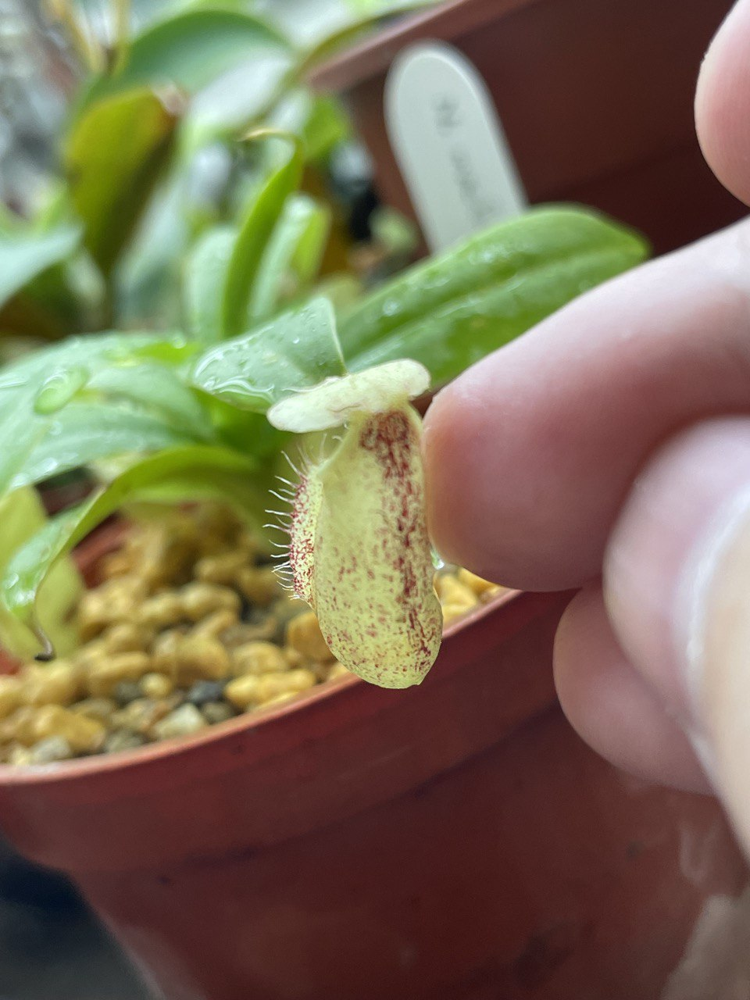
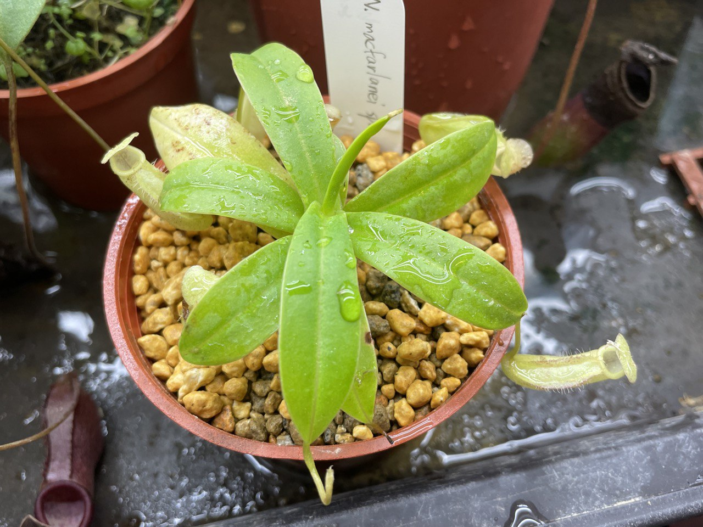
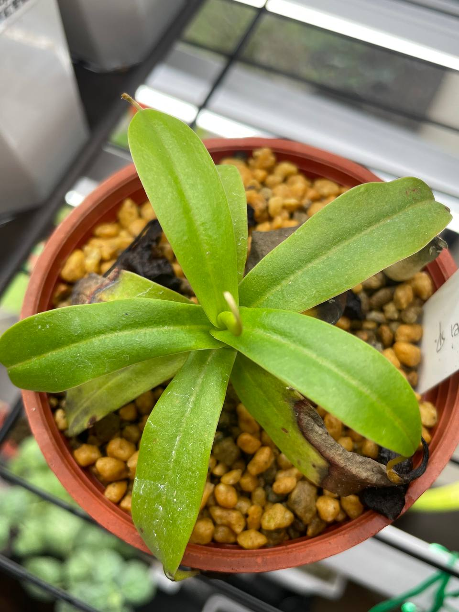

## 疑似麥克法蘭豬龍草

中文名稱：疑似麥克法蘭豬龍草  
學名：*Nepenthes* cf. *macfarlanei*  
購入管道：FB 食蟲社團  
購入價格：200 NTD  

### 2023/09/19 入手

賣家標示的名稱是 *N. macfarlanei* SP。  
我猜想應該是想表明不清楚來源，但表現類似於麥克法蘭。  
自己給他加上 cf.，表示是麥克法蘭的近似種。  
目前看起來，瓶子表現蠻像外國賣的麥克法蘭幼苗。  





### 2023/11/06

拿回來之後沒有悶養，過幾天發現植株脫水，趕緊套袋悶養。  
悶養持續至現在，看起來健康多了。  
目前在逐漸降低溼度，下個月再嘗試拿出袋子培養。  

