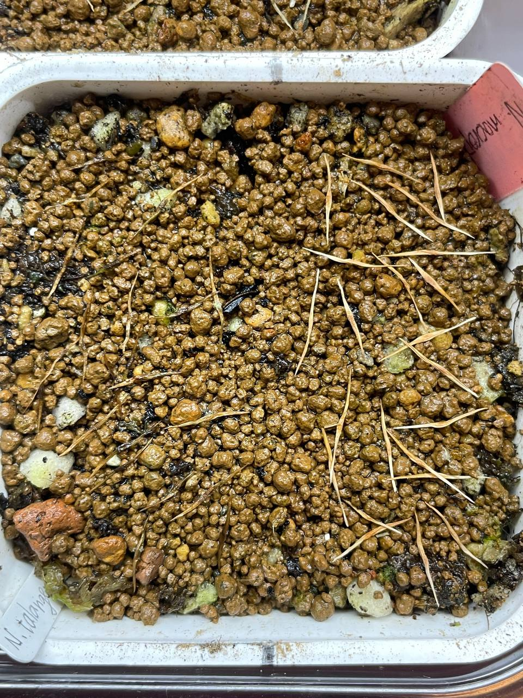

## 植物資料

中文名稱：大葉豬籠草  
學名：*Nepenthes macrophylla*  
購入管道：FB 台灣食蟲社團  
購入價格：500 NTD/20 顆種子  

唇肋非常明顯的種類，這類豬籠草在高地豬籠草裡面也是算海拔最高的那群，夏天一定要降溫。  
最難的長毛聽說夜溫要低於 18℃ 才不會葉縮，大葉海拔比長毛稍低，栽培溫度應該可以高一點。  

## 栽培紀錄

### 2024/01/05 播種

總共 23 顆種子，置於塑膠箱內悶養中。  
和塔蘭山豬籠草共用同個盆子播種，右側為大葉左側為塔蘭山。  
目前日/夜溫約 20/18℃。  

