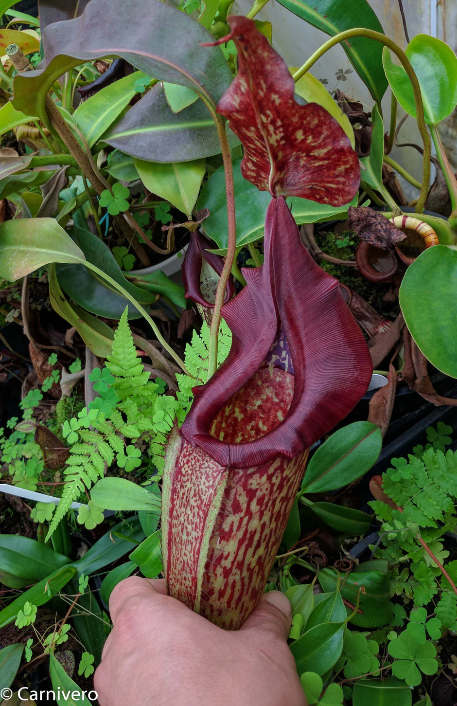
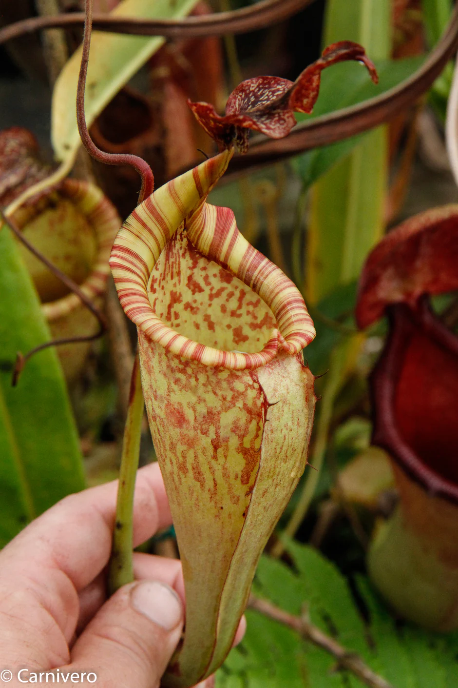
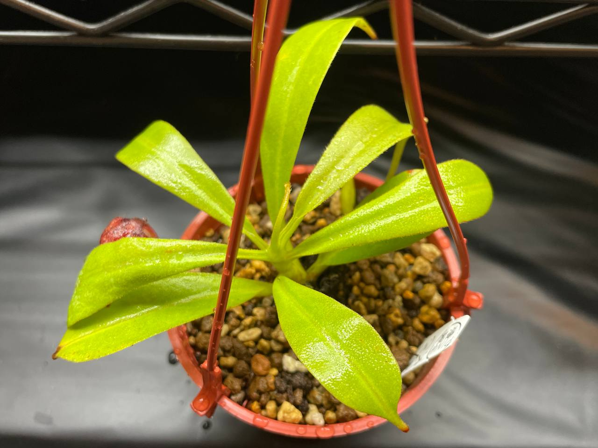
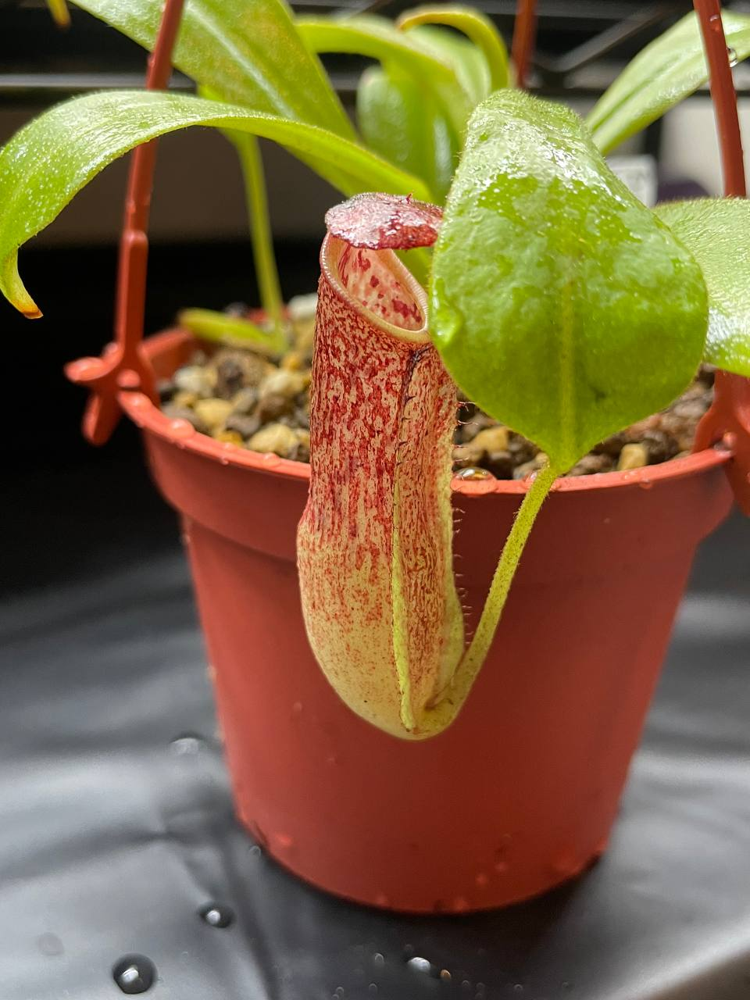

## 植物資料



中文名稱：大豬籠草  
學名及來源：*Nepenthes maxima* BE-3067  
購入管道：Ping 樂園  
購入價格：300 NTD  

大豬籠草分佈海拔十分廣泛，300-2600m 都有它的蹤跡，可以推估此種對於環境的適應性非常良好。  
也就有許多個體在市面上流通，若購買的個體來自高海拔，可能需要稍微注意夏天的降溫。  
這種豬籠草大多數個體，應該是比其他在高海拔局限性分佈的種類還要好種。  


  
  


Ping 樂園提供的照片與 [Carnivero](https://www.carnivero.com/products/nepenthes-maxima-be-3067) 的照片一樣。  
實際到手的植株瓶子也和此網站一樣，於是先照著這個網站標注來源為 BE-3067。  
依照 [Tom's Carnivores](https://tomscarnivores.com/plants/nepenthes-maxima/) 說的，BE-3067 只有一個 clone 且都是雌株。  
可觀察後續捕蟲瓶變化與花朵性別，進一步確認是否為 BE-3067。  

## 栽培紀錄

### 2023/12/11 入手


  
  

