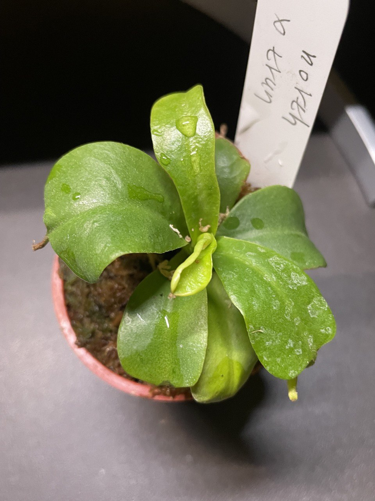
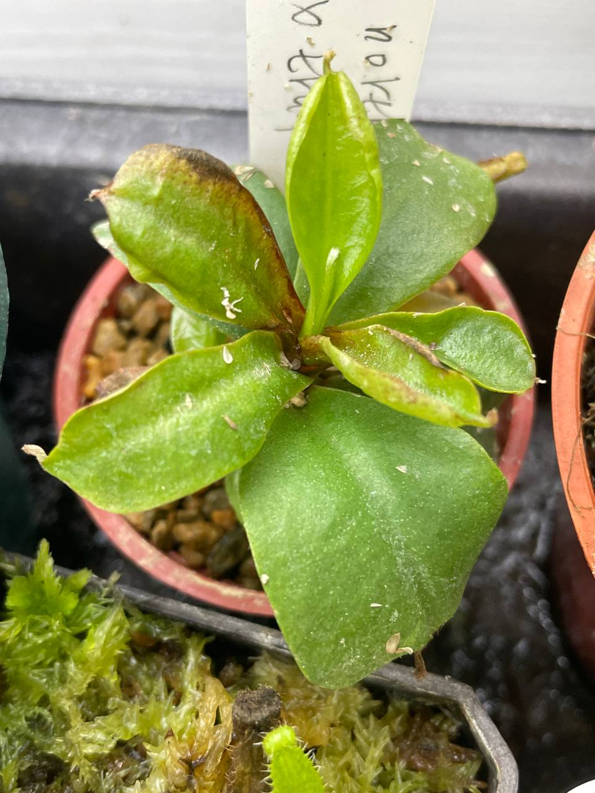

## 諾斯寶特豬籠草

中文名稱：諾斯寶特豬籠草  
學名：*Nepenthes northiana* x *truncata*  
購入管道：FB 食蟲社團  
購入價格：250 NTD  

### 2023/09/20 入手

新的幾片葉子形狀細長，似乎有點變形。  
此時點可能已經中薊馬了。  

### 2023/11/06

生長速度蠻快的，但發現許多薊馬蟲體，造成新葉扭曲、葉緣焦枯。  
施用亞滅培後，葉形恢復正常。  

