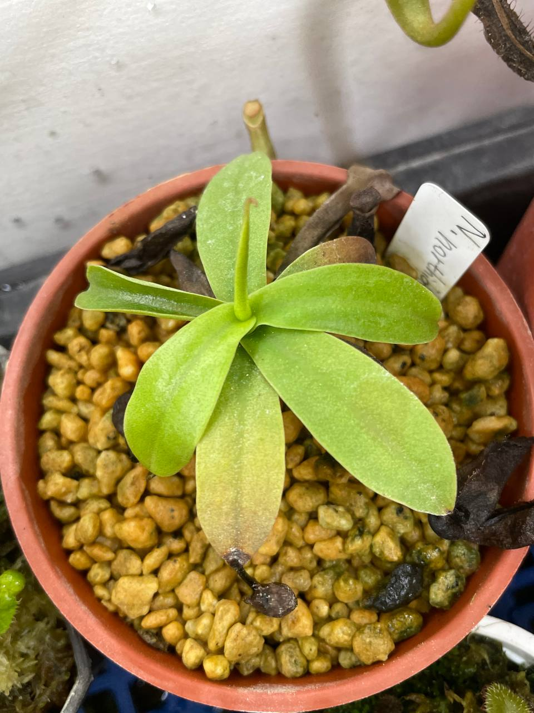

## 諾斯豬籠草

中文名稱：諾斯豬籠草  
學名：*Nepenthes northiana*  
購入管道：FB 食蟲社團  
購入價格：700 NTD  

### 2023/11/07

8/11 左右入手，沒有拍紀錄照。  
不過生長速度蠻快的，差不多一個月一片葉子。  

### 2024/02/02

12 月時中葉蟎，那時枯了不少葉子。  
新生的葉片也畸形，如圖中左側捲曲的葉片。  
施用亞滅培一段時間後，狀態慢慢回復了。  

