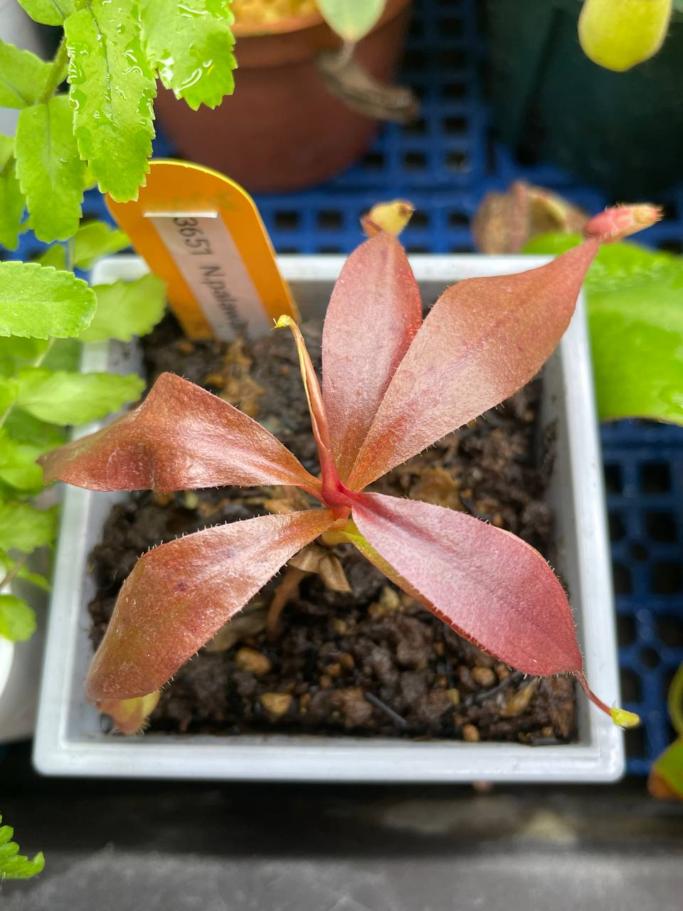

## 植物資料



中文名稱：巴拉望豬籠草  
學名：*Nepenthes palawanensis* be 3651  
購入管道：FB 食蟲社團  
購入價格：1200 NTD  

中高地豬籠草，原生於海拔 1100-1236 m 的山地灌木叢中。  
白天容易因為日照而升溫並降低溼度，推測他夏天只要在晚上降低溫度、提高溼度就能存活。  

## 栽培紀錄

### 2024/02/03 入手

紙質葉片，摸起來非常薄。  
室內燈養，目前日夜溫約 22/19℃。  

