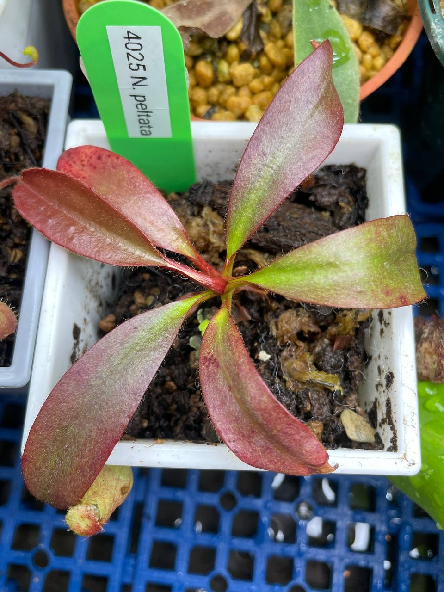
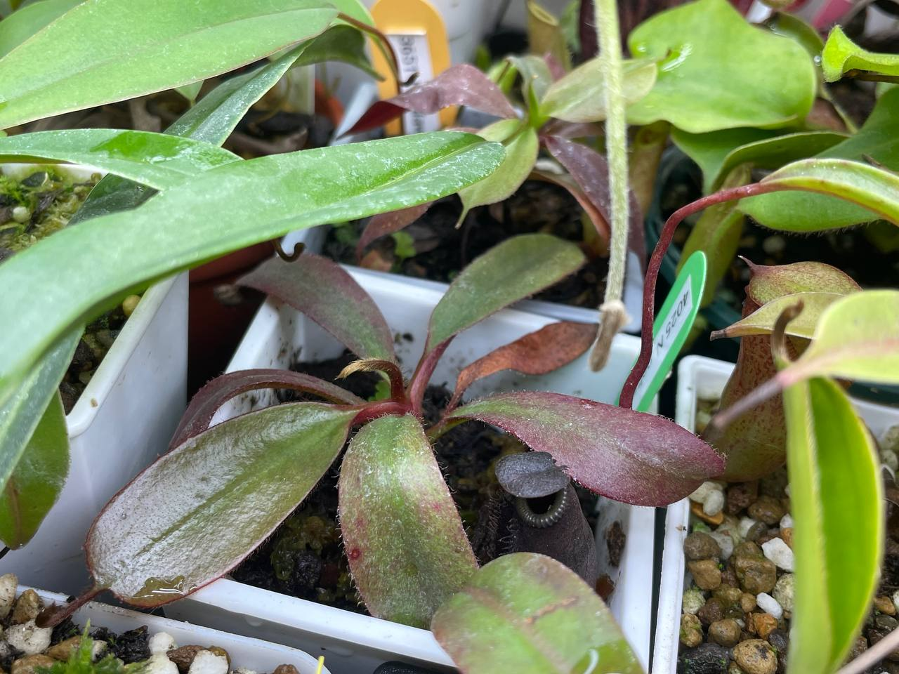

## 植物資料



中文名稱：盾葉毛豬籠草  
學名及來源：*Nepenthes peltata* be 4025  
購入管道：FB 食蟲社團  
購入價格：850 NTD  

中高地豬籠草，原生海拔 865-1400 m。  
be 4025 這個 SKU 似乎包含了許多 clone，所以種出來瓶子不一定會和 Borneo Exotics 提供的官方照一樣。  
不過台灣的園藝商有取得多少種 clone 就不得而知了。  

## 栽培紀錄

### 2024/02/03 入手

室內燈養，目前日夜溫約 22/19℃。  

### 2024/04/10

還是室內燈養，目前日夜溫約 26/24℃。  
看來環境蠻適合的，剛入手時長到一半的葉子還是有結瓶。  
圖二左邊是毛毛豬有點粉色的瓶子，右邊是 CK 維奇結到一半的瓶子。  


  
  

