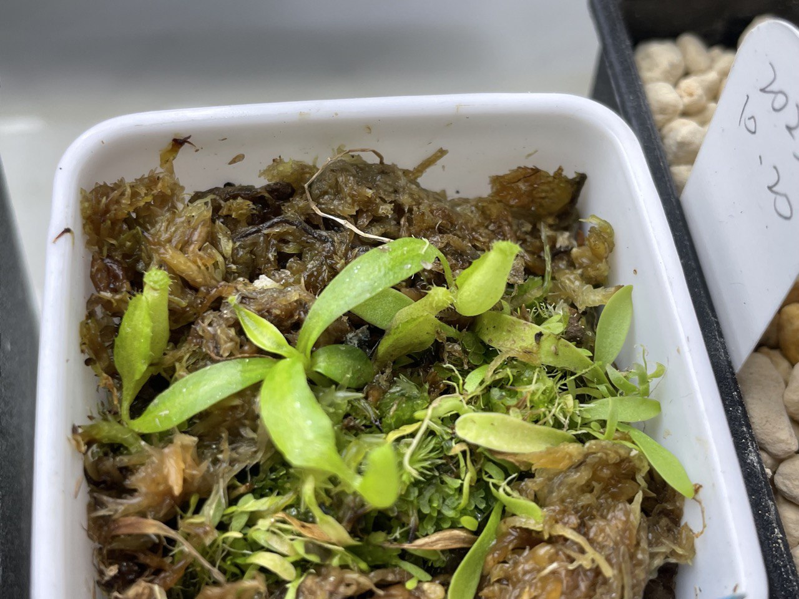
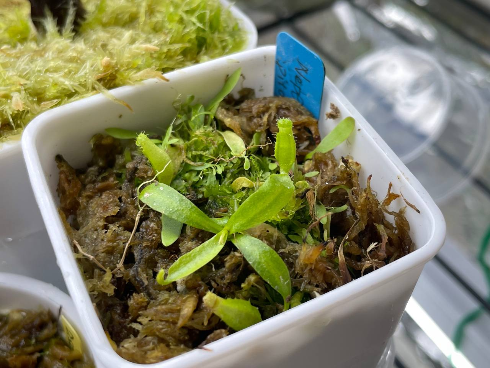
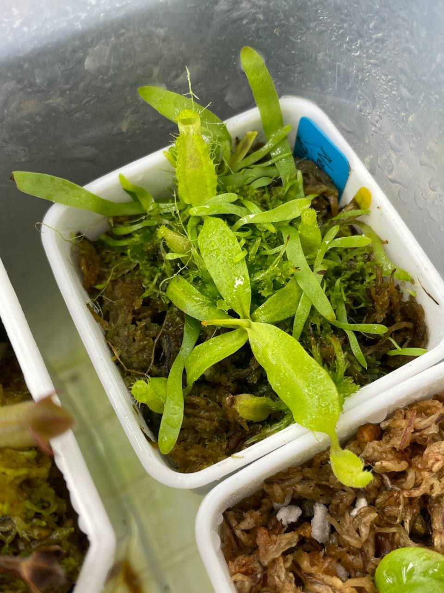
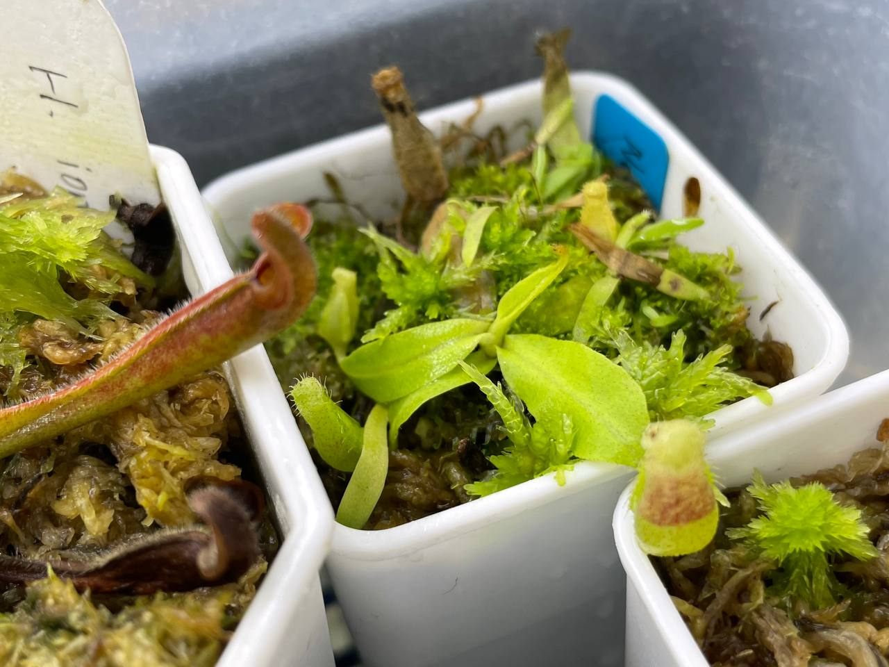

## 皮托龐豬籠草

中文名稱：皮托龐豬籠草  
學名：*Nepenthes pitopangii*  
購入管道：FB 食蟲社團  
購入價格：900 NTD  

夏季溫度：日/夜溫 26/22.5℃，使用製冷晶片小冰箱  
冬季溫度：台灣冬季不需保暖設備，但過冷的氣溫會使生長速度變慢  
濕度：70% 以上

目前較少見的種類。  
高地偏中地的豬籠草，下位瓶讓我想到蓋亞豬籠草，而上位瓶類似馬桶豬籠草的馬桶狀。  
耐熱性還不錯，長大後可以考慮夏天室內跟人一起吹冷氣。  

### 2023/10/20 入手

目前置於冰箱較陰暗的位置，並加蓋種植。  

### 2023/11/01

### 2023/12/25

一個月兩片葉子的速度。  
目前室內燈養中，日/夜溫約 22/16-17℃。  

### 2024/02/02

低於 20℃ 的夜溫使幼幼瓶也顯現紅色。  
生長速度算快，約一個月一片葉子。  
不過一片不算老的葉子突然枯萎（圖上方），可能需要多注意植株狀態。  

