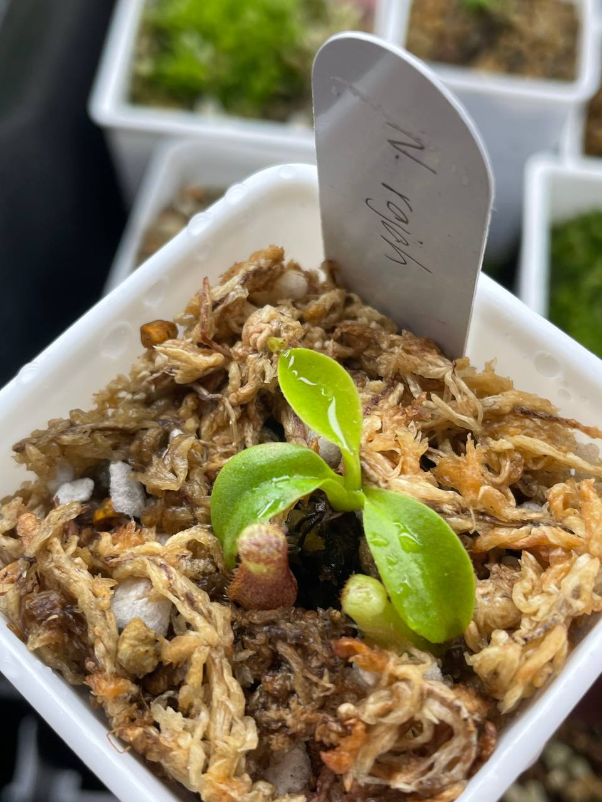
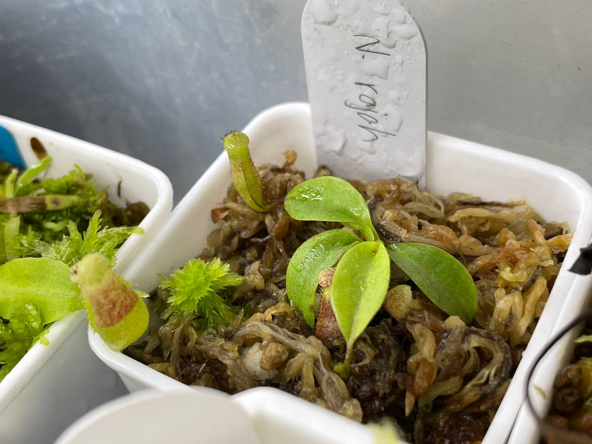

## 植物資料



中文名稱：馬來王豬籠草  
學名：*Nepenthes rajah*  
購入管道：FB 食蟲社團  
購入價格：500 NTD  

瓶子尺寸最大的豬籠草種類，大小可以與之相比的大概只剩美林和寶特瓶豬籠草。  
聽說一開始長得很慢，直到直徑 10 cm 以後會比較好。  

## 栽培紀錄

### 2023/12/25 入手

室內燈養，目前日溫最高 22℃，夜溫則約 16-17℃。  

### 2024/02/02

目前生長速度不慢，約一個月一片葉子。  

