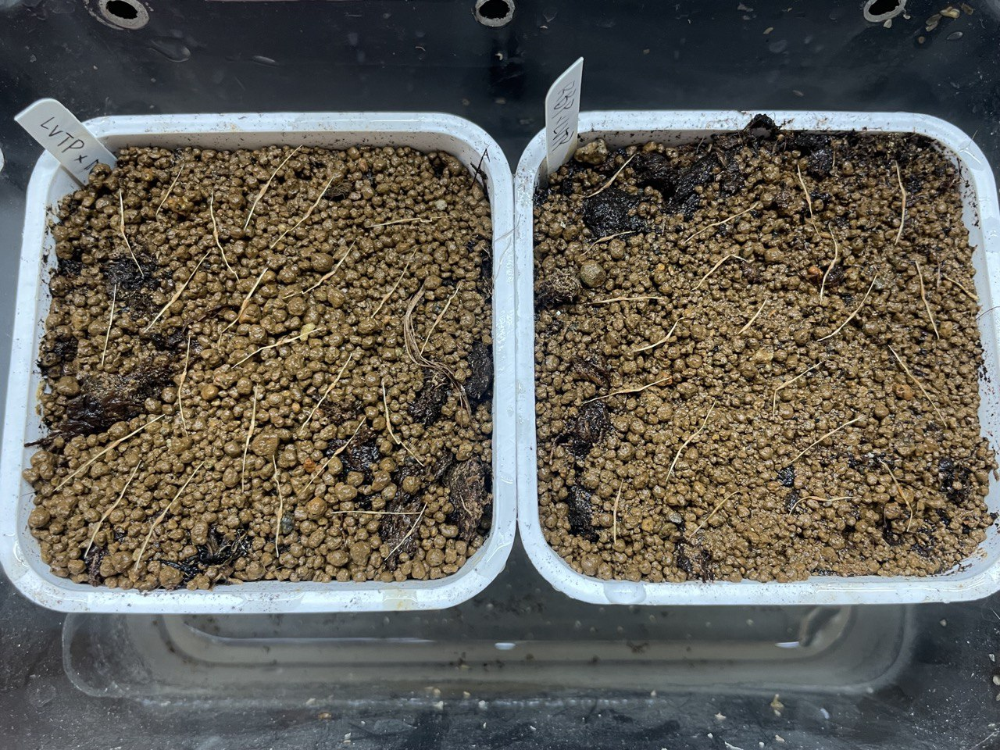

## 植物資料

中文名稱：[(六甲包希) x 寬唇] x [(勞氏維奇) x (大豬維奇) x 寬唇]  
學名交配式：*Nepenthes* [('Rokko' x *boschiana*) x *platychila*] x [(*lowii* x *veitchii*) x 'Tiveyi' x *platychila*]  
購入管道：FB 食蟲社團  
購入價格：300 NTD/20 顆種子  

寬唇的血佔了二分之一，有希望能看到寬厚花唇的植株。  
不過寬唇特徵要等上位瓶才能觀察到，從實生開始應該要等三年跑不掉。  

## 栽培紀錄

### 2023/11/22 播種

播種後淺腰水（約 1 cm），至於塑膠箱中悶養。  

