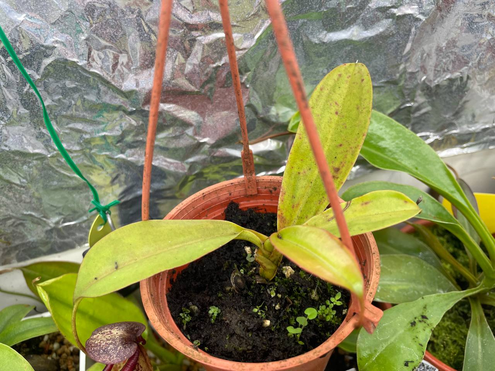
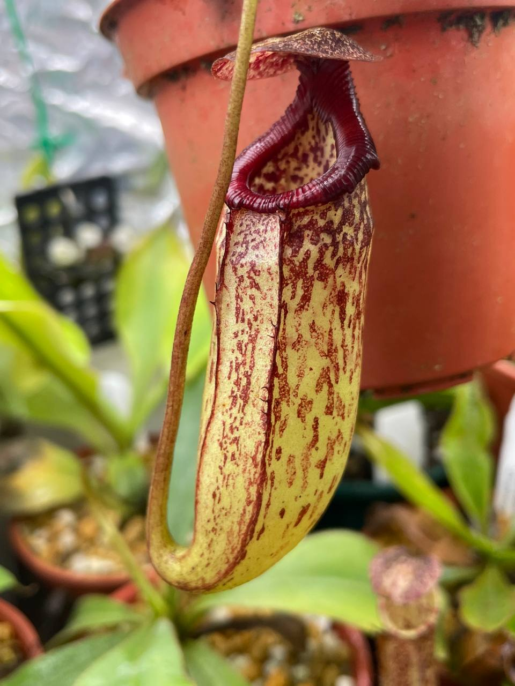

## 植物資料

中文名稱：辛布交大豬籠草 建國花市版  
學名：*Nepenthes sibuyanensis* x *maxima*  
購入管道：建國假日花市  
購入價格：100 NTD  

購買時沒有花牌。  
原本當作花市豬看外表喜歡就買了，結帳時攤主告知是辛布亞島交大豬籠草。  
外觀與我認知的辛布大豬長得不太一樣，再觀察看看。搞不好是不同個體？  

## 栽培紀錄

### 2024/01/06


  
  

