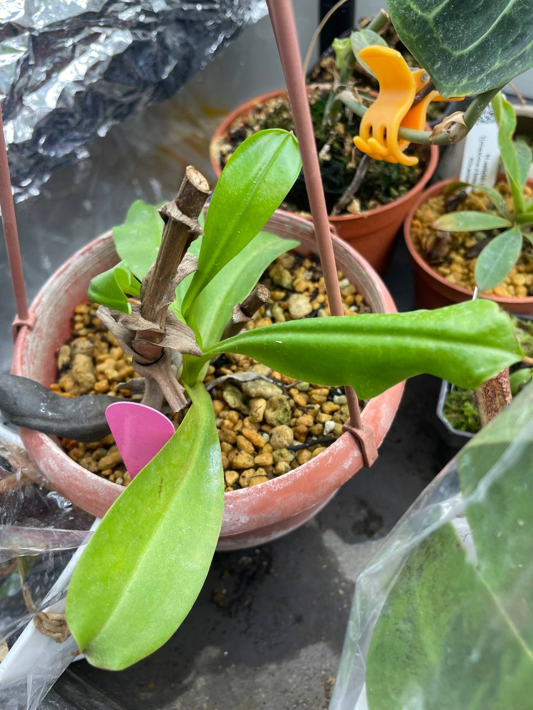
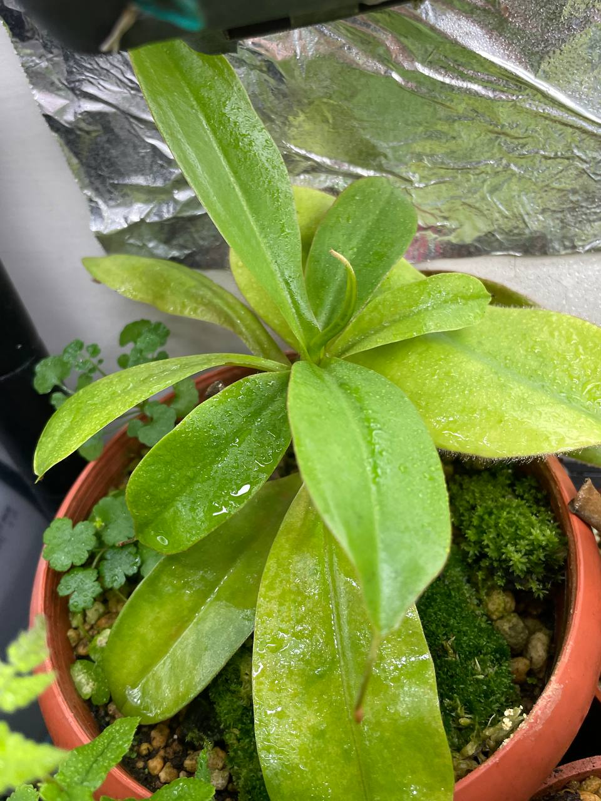

## 辛布大豬籠草

中文名稱：辛布大豬籠草  
學名：*Nepenthes sibuyanensis* x *maxima*  
購入管道：FB 食蟲社團  
購入價格：200 NTD  

### 2023/11/04 入手

瓶子可以蠻大的，而且流通度蠻高的一個交種，只是價格一直超過我預期。  
這次終於等到不錯的價格可以入手。  
雖然是強健的豬，但結瓶條件似乎需要穩定的濕度。  

### 2024/04/10

多了很多葉子，但一個瓶子都不結。  
很挑環境的品種。  

