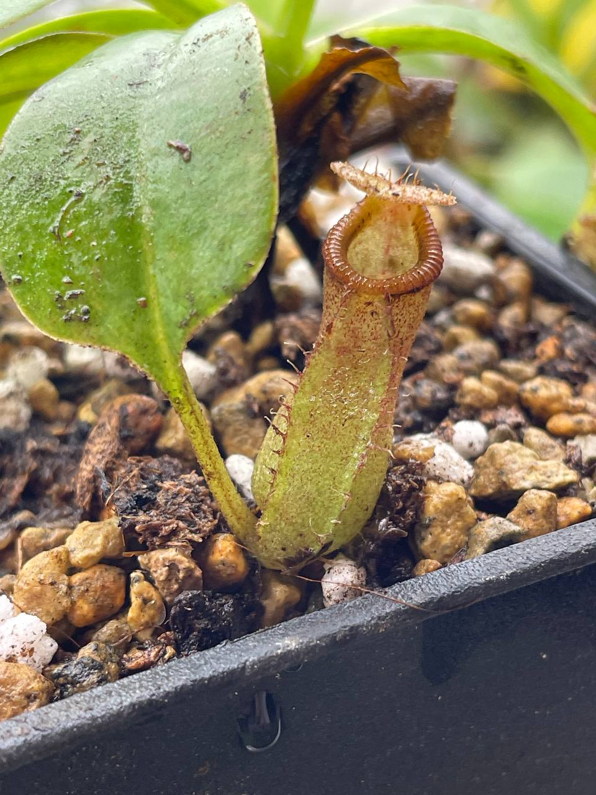
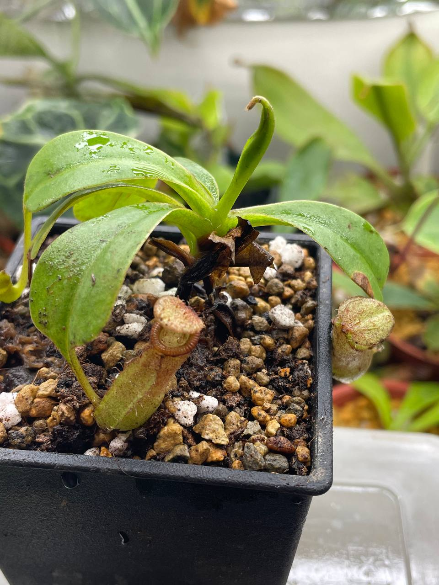

## 植物資料



中文名稱：辛布亞交黑寶特豬籠草  
學名交配式：*Nepenthes sibuyanensis* x *robcantleyi*  
購入管道：FB 食蟲社團  
購入價格：600 NTD  

親本都是中高地的豬籠草，但分佈海拔很廣，從一千初到兩千多公尺都有。  
應該能以中地豬籠草條件種植，晚上微降溫就能度夏。  

## 栽培紀錄

### 2023/11/30 入手


  
  


### 2024/04/11 死亡

病徵類似於[午夜植物園文章](https://www.facebook.com/share/p/C3NmxtRNGo9xXhJd/)說的真菌感染，芽點爛掉基本沒救。  
需要考慮定時噴藥了，文章建議使用滅達樂與三氟德克力，及加入芽孢桿菌或木黴菌等共生菌來防治。  
