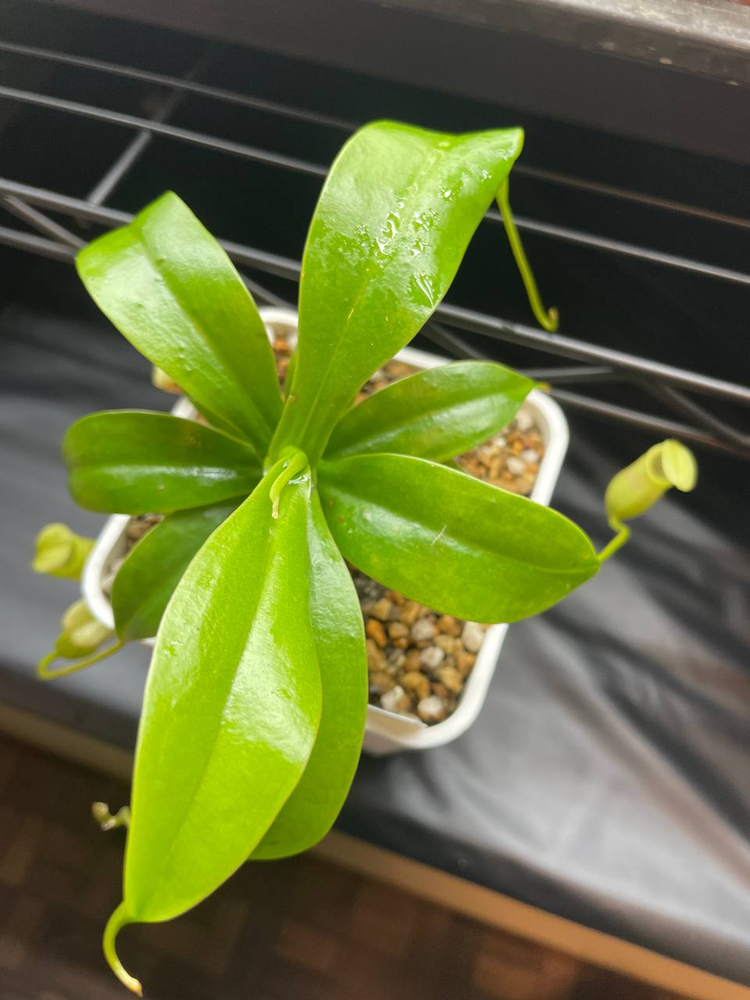
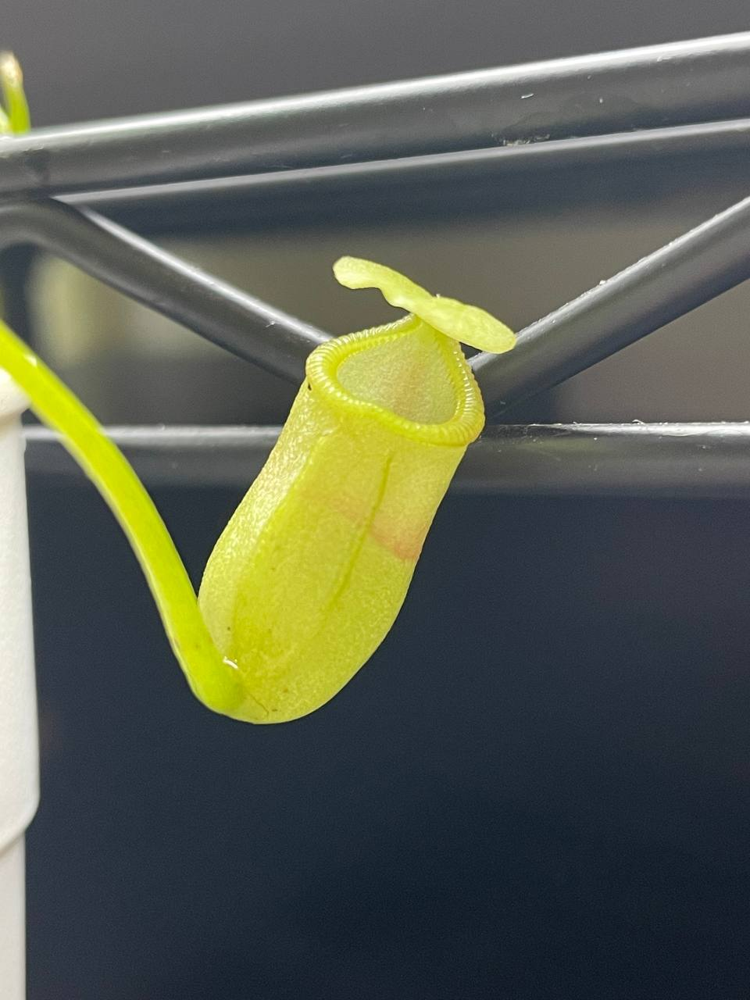

## 植物資料



中文名稱：辛布亞島豬籠草  
學名：*Nepenthes sibuyanensis*  
購入管道：Ping 樂園  
購入價格：1300 NTD  

具有矮胖大瓶的種類，結瓶條件似乎需要穩定的濕度，雖然葉片可以曬但瓶子要遮陰。  
半埋入土裡的瓶子似乎能生長得最好。  

## 栽培紀錄

### 2023/12/09 入手

植株大棵健康，先放置於高濕度的角落栽培。  


  
  

