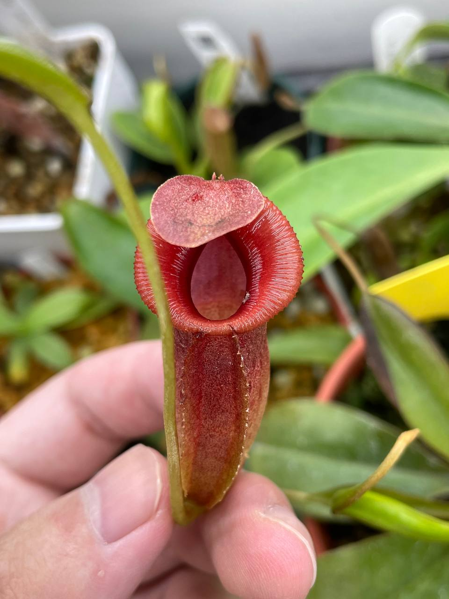
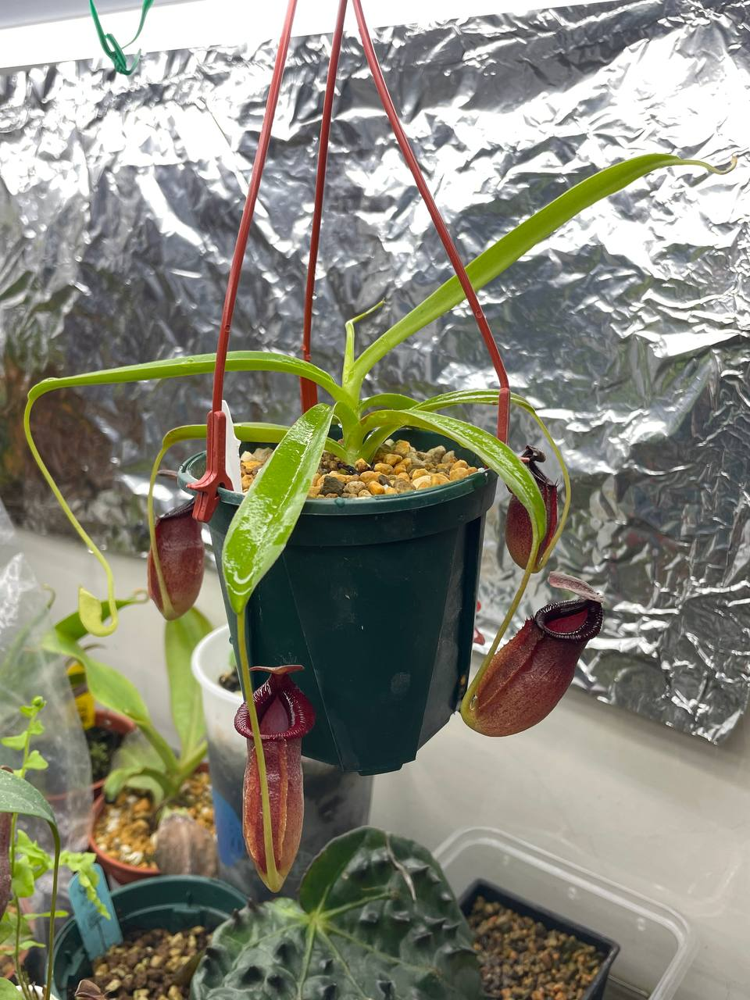
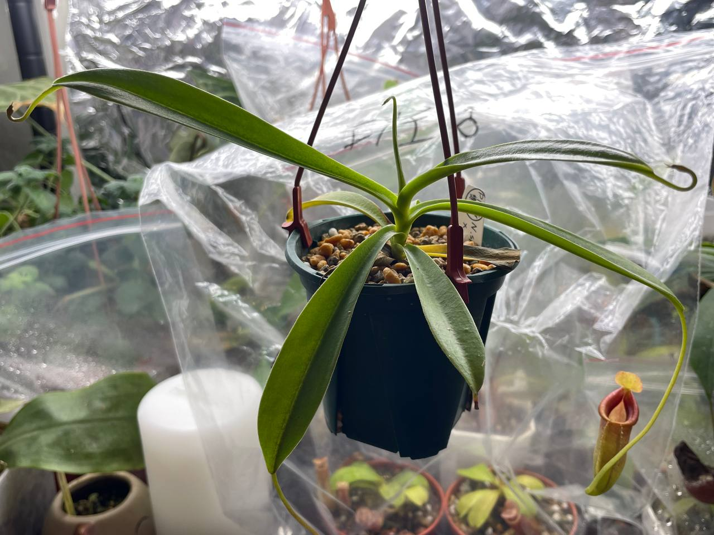
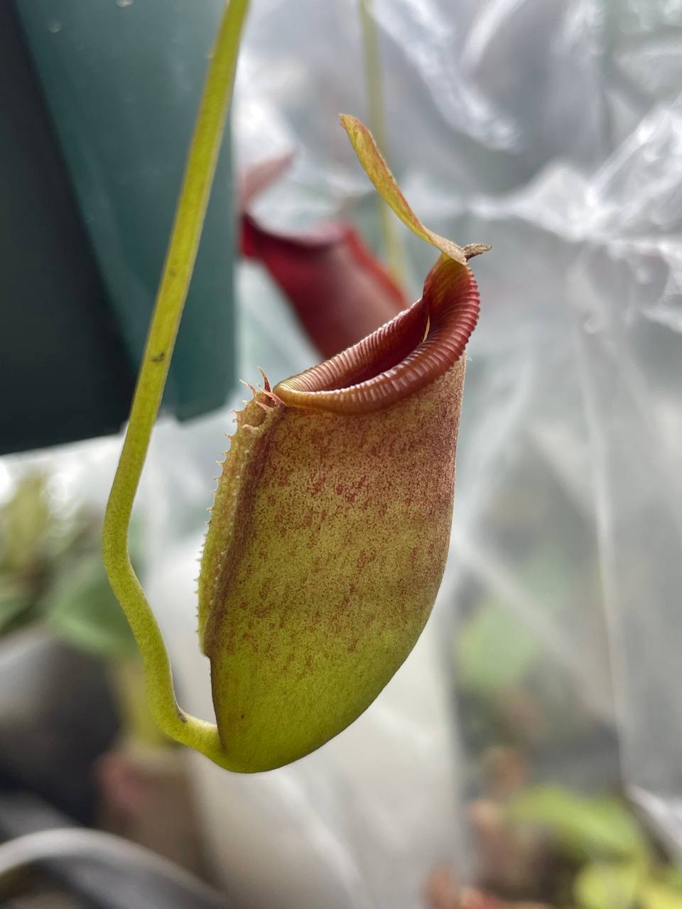
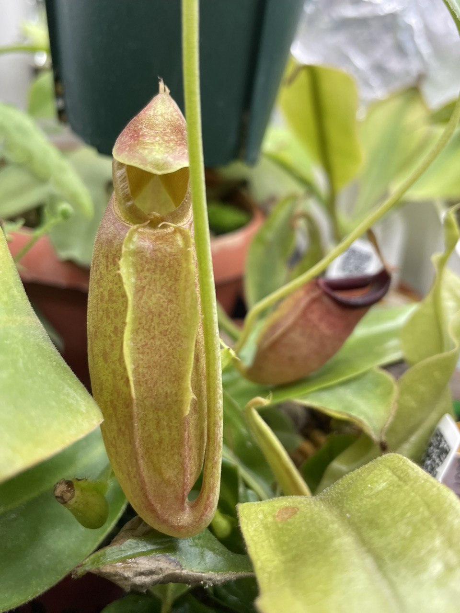
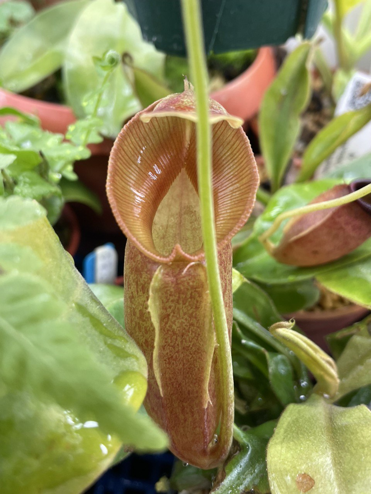
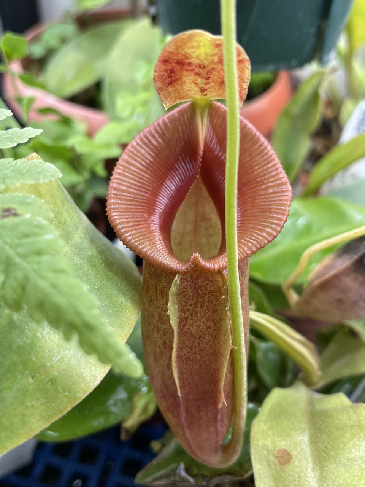
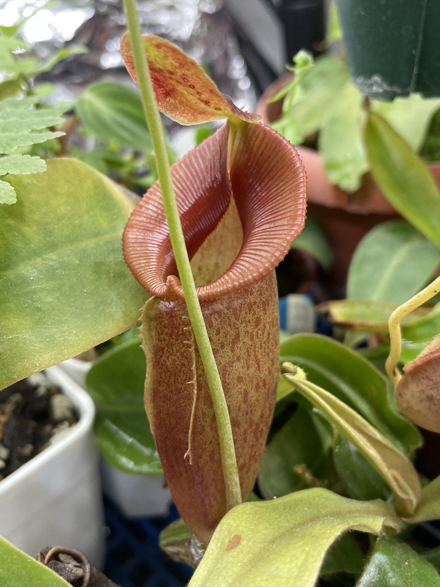
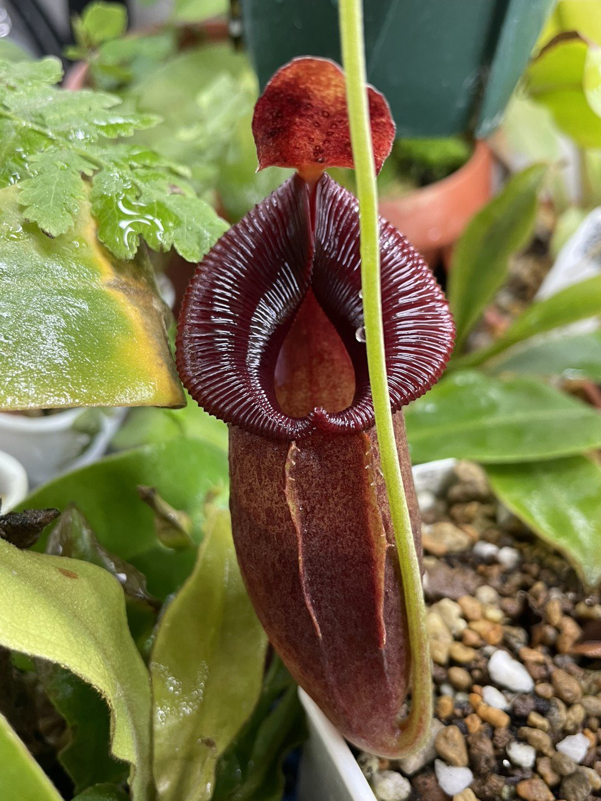
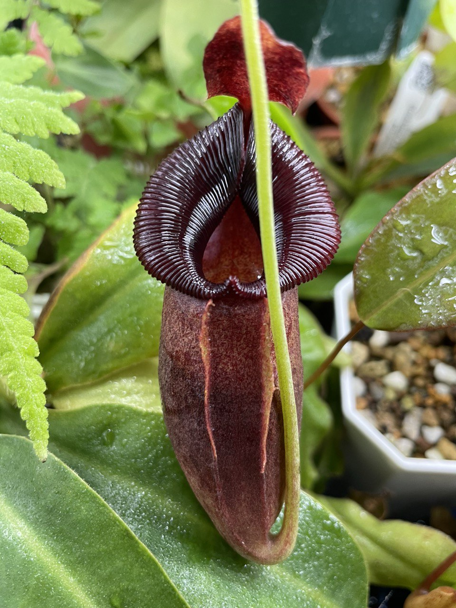

## 植物資料



中文名稱：匙葉交賈桂琳豬籠草  
學名：*Nepenthes spathulata* x *jacquelineae*  
購入管道：蝦皮 PING 樂園  
購入價格：1800 NTD  

外觀為匙葉的斜口，加上賈桂琳寬大的唇。  
交種後耐候性似乎蠻不錯的，個人是當作好種版的賈桂琳來對待。  

### 2023/11/04 入手

寬大橢圓的唇，非常對稱。  


  
  
  


### 2023/12/06 新葉微扭曲

照片沒照到，不過新展開的葉片葉緣些微扭曲。  
可能是環境變動、濕度不夠等因素造成，再觀察下一片葉子看看。  
新生的瓶子剛開始是全綠的，幾天後從上面開始慢慢轉紅。  


  
  


### 2024/02/27 開始轉中位瓶

唇變寬，且翼的特徵變得較不明顯。  


  
  
  
  


### 2024/03/15、04/08 顏色變深

沒有移動植株，沒有結新的瓶子，可能是天氣的濕度變動太大。  
唯一的瓶子顏色持續變深。  


  
  

