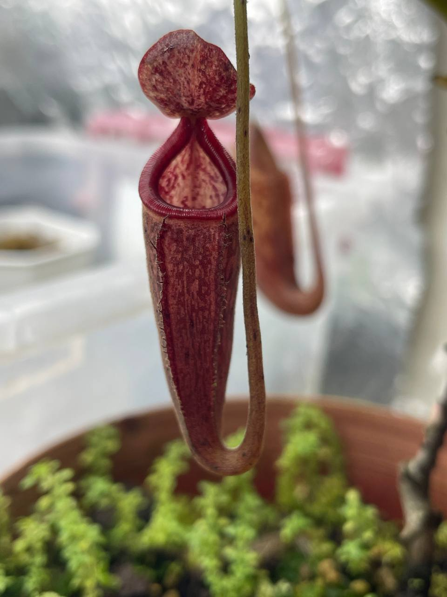
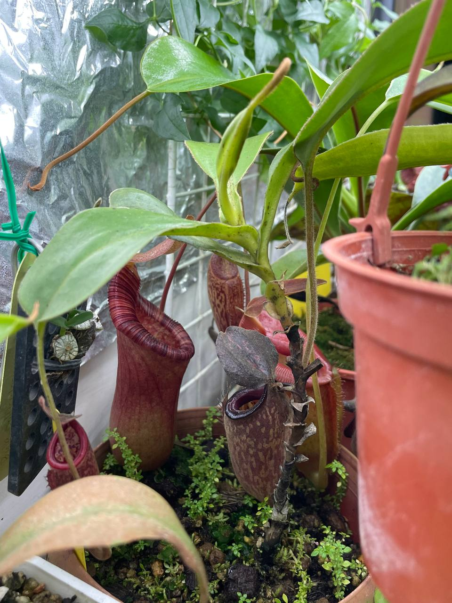

## 植物資料



中文名稱：塔蘭山交有腺豬籠草  
學名：*Nepenthes talangensis* x *glandulifera*  
購入管道：建國花市  
購入價格：800 NTD  

第一眼就覺得瓶子整體看起來很有腺，只可惜沒什麼毛。  
親本都是中高地豬籠草，夏天時需要觀察，只有夜晚微降溫的植株狀況。  
親本有塔蘭山，那應該能適應光照較強的環境。  

## 栽培紀錄

### 2024/06/01 入手

莖部有蠻大一段都已經木質化，但頂芽葉展不大。  
帶兩個瓶子，一個尚未開瓶（圖二正中間）。  


  
  

