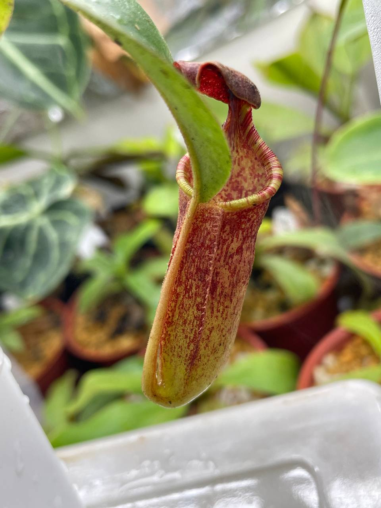
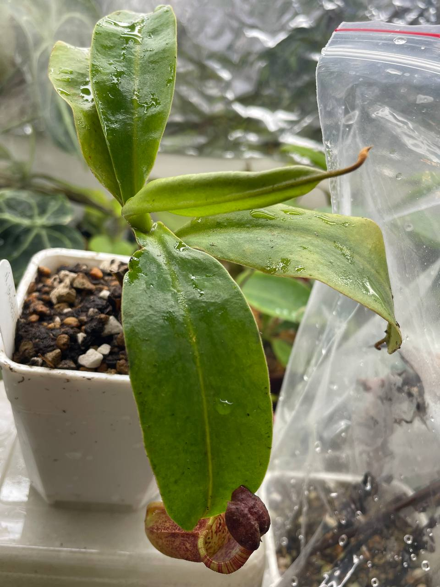

## 植物資料



中文名稱：(高棉風鈴) x 阿拉蒂豬籠草  
學名交配式：*Nepenthes* (*thorelii* x *campanulata*) x 'Allardii'  
購入管道：FB 食蟲社團  
購入價格：600 NTD  

N. x'Tiveyi' 和 N. x'Allardii' 都是維奇豬籠草與大豬籠草交種。  
不過 N. x'Tiveyi' 是 N. *maxima* x *veitchii*；  
N. x'Allardii' 則是 N. *veitchii* x *maxima*。

親本都是耐候性強的好豬，交種出來的子代應該能以低地豬籠草的條件種植。  

## 栽培紀錄

### 2023/11/30 入手

目前表現大口花唇，十分好看。  


  
  

