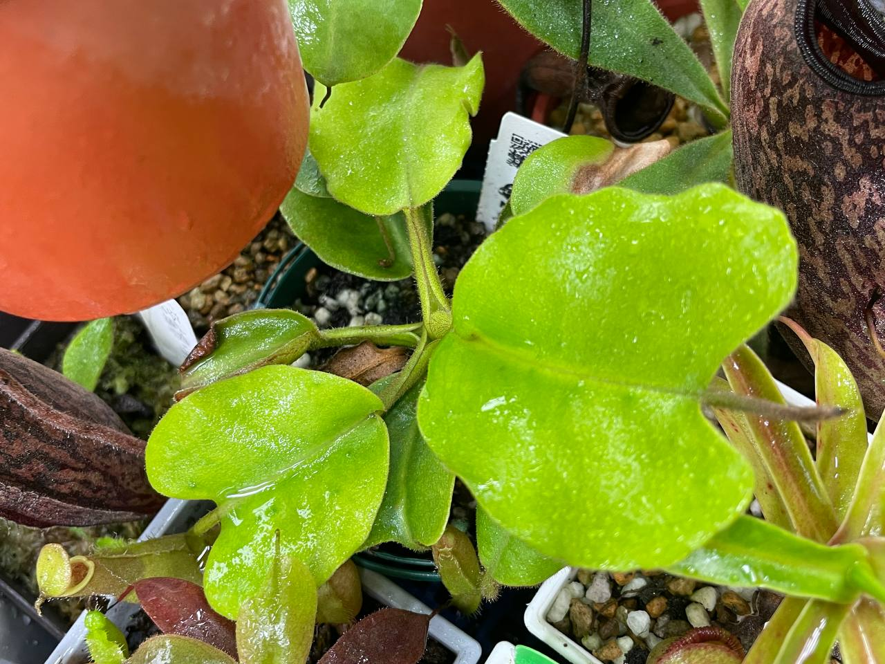

## 寶特瓶豬籠草

中文名稱：寶特瓶豬籠草  
學名：*Nepenthes truncata*  
購入管道：蝦皮 CarnivoRUs 珍奇植物  
購入價格：449 NTD  

### 2023/07/24 入手

### 2023/11/07

生長速度極慢，兩個月長一片葉子。  
上一片葉還畸型小瓶子，現在總算看到正常發育的瓶子。  
可觀察到微微花唇。  





### 2024/04/10

葉片持續生長，但不太好結瓶。  
過程中只要環境變動，膨大到一半的瓶子就僵住不動，最後變成畸形瓶。  

