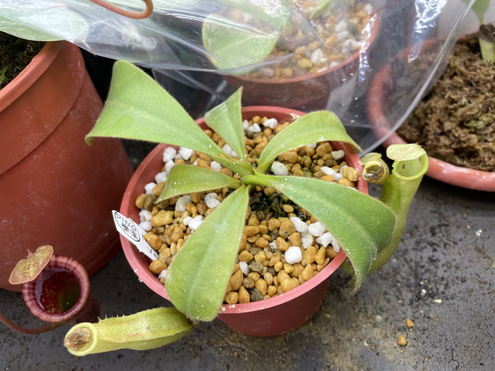
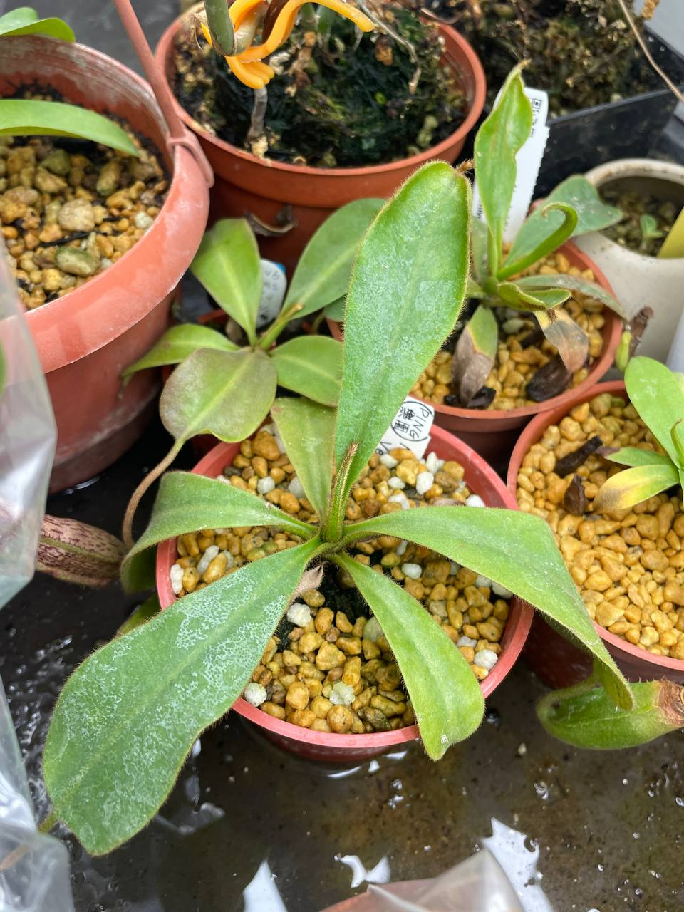
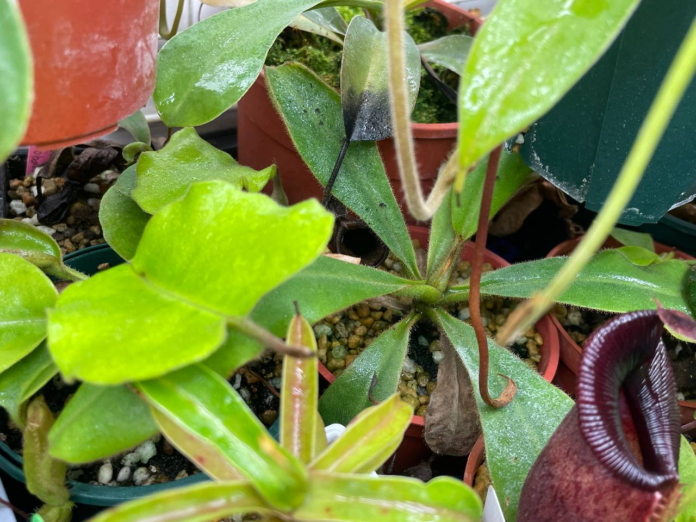
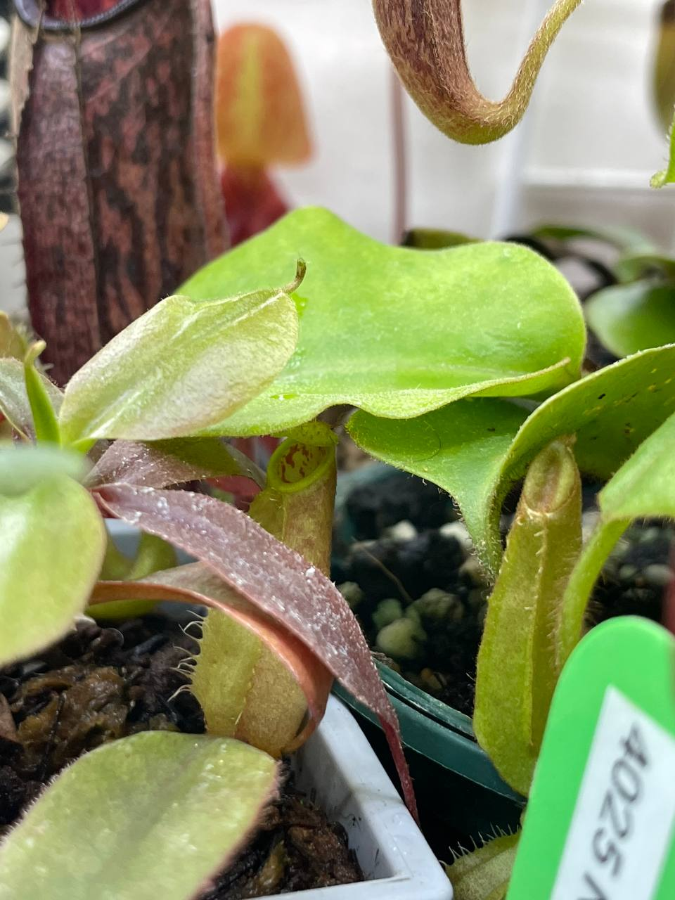

## CK 維奇豬籠草

中文名稱：CK 維奇豬籠草  
學名及來源：*Nepenthes veitchii* Gunung Murud Striped x *veitchii* Candy Stripe  
購入管道：蝦皮 PING 樂園  
購入價格：1000 NTD  

### 2023/08/07 入手

Christian Klein 出品的維奇豬籠草，聽說小難種有點怕熱。  

### 2023/11/07

在瓶子內施用緩效肥。  
生長速度還是普通偏慢，不過葉子有持續變大。  

### 2024/04/10

生長情況良好，葉子有變大，籠蔓也正在結瓶。  
圖二左為毛毛豬瓶子，右為 ck 維奇生長到一半的瓶子。  


  
  

