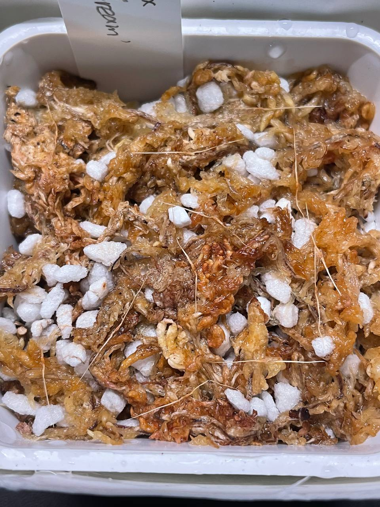
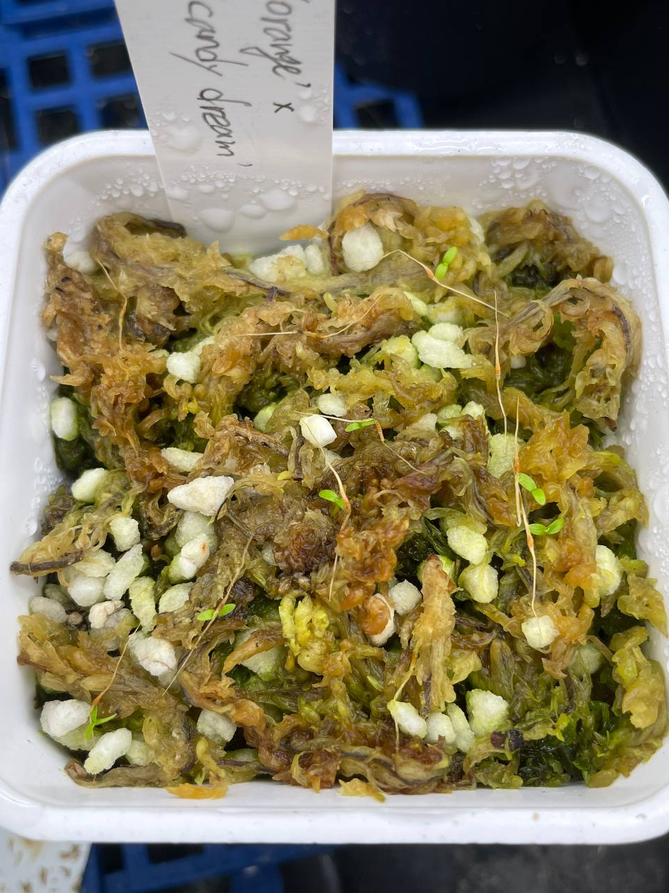

## 植物資料



中文名稱：維奇豬籠草  
學名：*Nepenthes veitchii* 'Orange' x 'Candy Dream'  
購入價格：800 NTD / 12 顆種子  

維奇分佈的海拔很廣，種植時需要注意個體原生的海拔，耐熱性不同。  

## 栽培紀錄

### 2024/04/28 播種

以水苔混合珍珠石作為介質，置於 20-25℃ 的小冰箱，並加蓋增加濕度。  

### 2024/06/23 發芽

目前子葉正常展開的苗有 7 棵，發芽率還不錯。  

