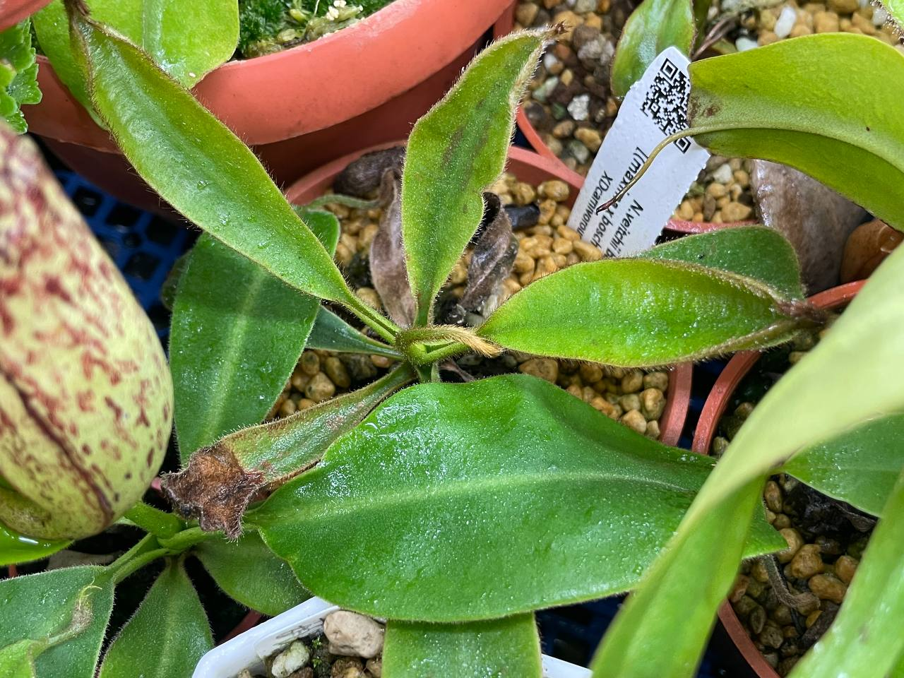

## 維奇 x [(大豬包希) x 維奇]豬籠草

中文名稱：維奇 x [(大豬包希) x 維奇]豬籠草  
學名及產地：*Nepenthes veitchii* bario x [(*maxima* x *boschiana*) x *veitchii*]  
購入管道：蝦皮 《XD 蝕驗室》  
購入價格：620 NTD  

### 2023/07/24 入手

維奇的特徵，葉緣毛絨很明顯。  

### 2023/11/07

有對瓶子施用緩效肥。  
目前長出來的葉子稍微畸形，不確定是肥料還是天氣太熱導致。  

### 2024/04/10

冬天生長的葉子還是不太正常，可以確定不是太熱導致。  
這陣子也沒給肥料，澆的水使用的是除濕機廢水。  
接下來可能是染菌，或者單純組培出來激素還沒退乾淨，總之繼續觀察看看。  

