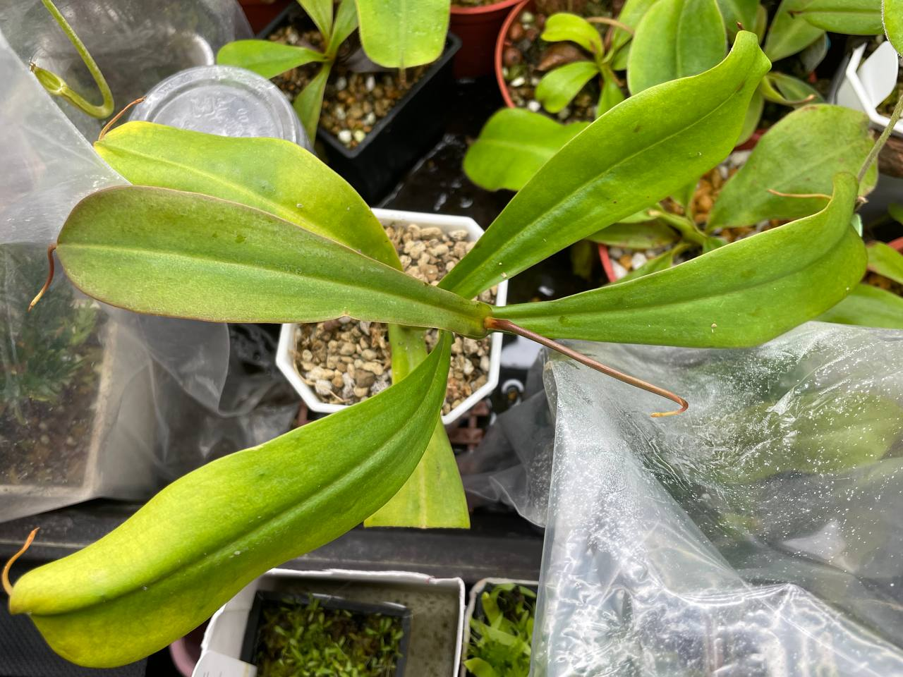
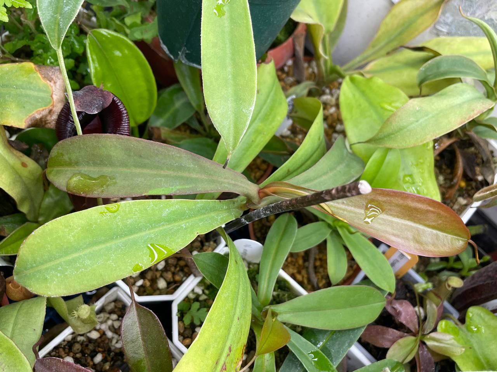
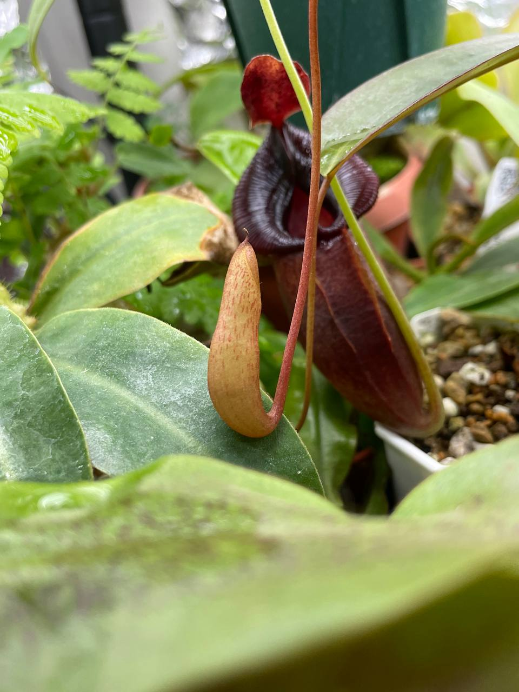

## 植物資料



中文名稱：葫蘆交馬普魯山豬籠草  
學名：*Nepenthes ventricosa* x *mapuluensis*  
購入管道：台灣 FB 食蟲植物社團  
購入價格：350 NTD  

斑紋蠻具有馬普魯山特色。  
好種的葫蘆與中低地的馬普魯山交種後，子代應該也不會太難種植。  

## 栽培紀錄

### 2024/01/28 入手

直徑蠻大棵的，目前無瓶。  
入手時微根，老葉末端稍微黃化。  

目前套袋室內燈養中，日夜溫約 22/18℃ 左右。  

### 2024/04/10

日夜溫約 26/24℃。  
有兩個籠蔓末端都在膨大中，希望不要長成畸型瓶。  


  
  

