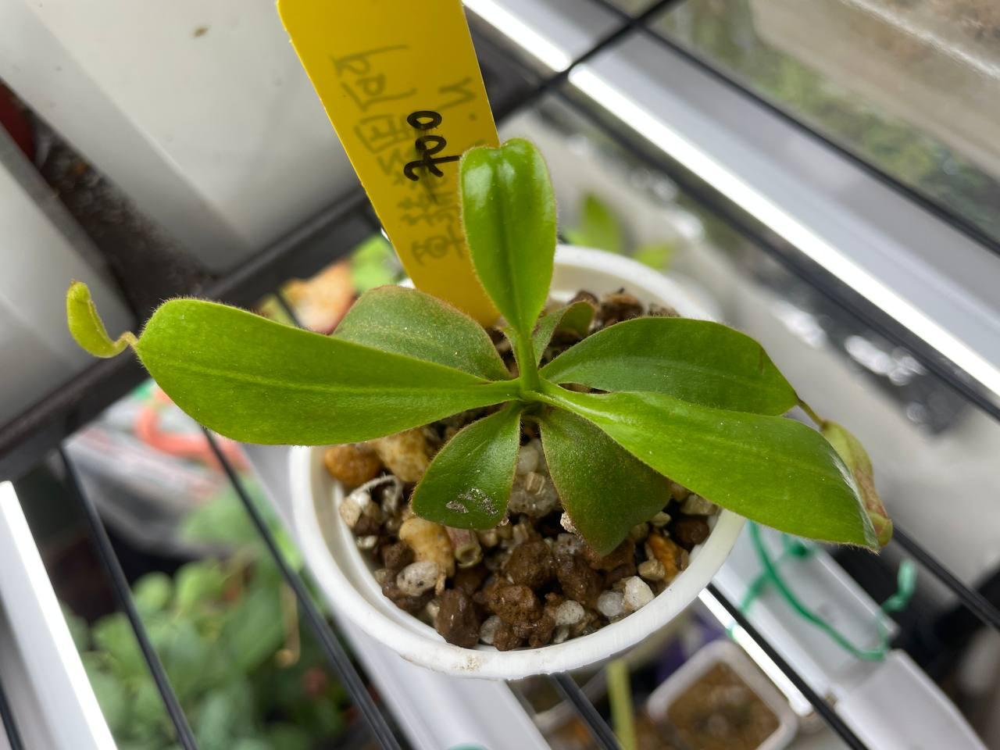

## 阿里豬籠草

中文名稱：阿里豬籠草  
學名：*Nepenthes* x 'Alisaputrana'  
購入管道：2023 台北食蟲植物交流會  
購入價格：700 NTD  

豹班與馬來王的自然雜交種，約生長在海拔 2000 m。  
外觀上保留了馬來王寬唇巨瓶的特色。  

這棵有趣的是原本攤位上賣得不貴，卻沒有人要買。  
結果拿去競標，結標價格比我入手的還高。  
旁邊馬來王倒是賣得很快，我看到的下一秒就被人拿在手中再也不放下了。  

### 2023/11/04 入手

### 2023/12/25

大約是一個月長一片葉子的速度，意外的快。  
明明親本純豹斑在我這裡速度龜到不行，這就是雜交優勢嗎。  

不過最新的葉子看來有點縮小。  
目前室內燈養，日溫頂多 23℃，夜溫 16-17℃，應該對他來說不會太熱。  
比較有可能是這陣子濕度太低，一般室內可以到 60%。  
雖然養殖環境有半悶養加濕，但波動蠻大的。  




