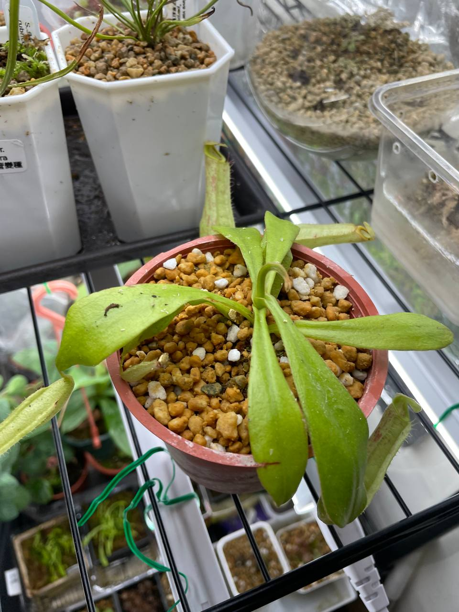
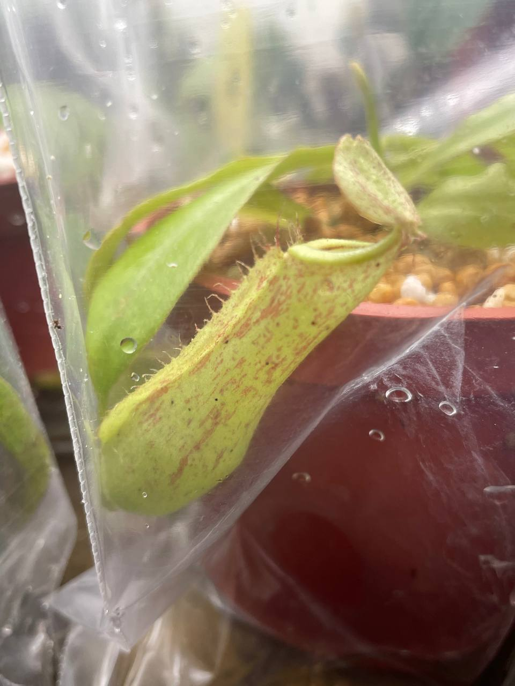

## 戴瑞安娜豬籠草

中文名稱：戴瑞安娜豬籠草  
學名：*Nepenthes* x 'Dyeriana'  
購入管道：蝦皮 PING 樂園  
購入價格：400 NTD  

*N. x 'Dyeriana'* = [(*N. northiana* x *maxima*) x (*N. rafflesiana* x *veitchii*)]。  
流通已久，強健的低地豬，前陣子突然很熱門。  
會長得很巨大，希望養大之後能丟到半戶外的環境看他吃蟲。  

### 2023/11/04 入手




