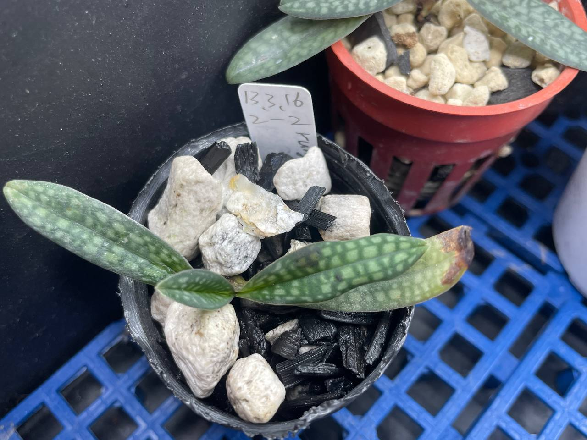

## 植物資料

中文名稱：朗氏拖鞋蘭  
學名：*Paphiopedilum rungsuriyanum*  
購入管道：白河蘭園  
購入價格：700 NTD  

植株小花梗短，相較之下花朵尺寸大得誇張，喜歡小型植物的話很值得栽培。  
喜歡較高空氣濕度，光照則不用太強。  
目前置於中低地豬籠草的環境栽培，給水頻率稍低於豆蘭。  
老闆說大約 4-5 片葉子會開花，可以期待看看。  

## 栽培紀錄

### 2024/06/16 入手

以蘭石和木炭作為介質。  

