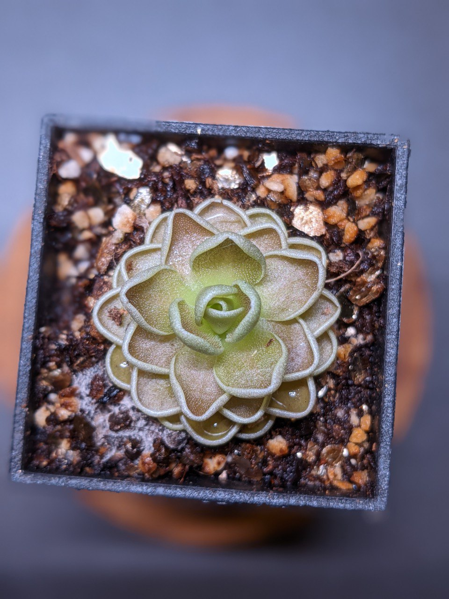
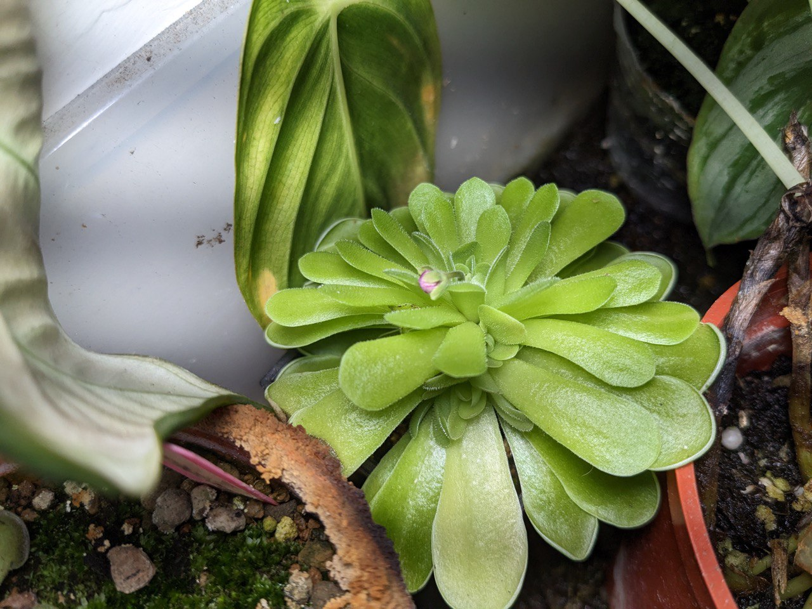
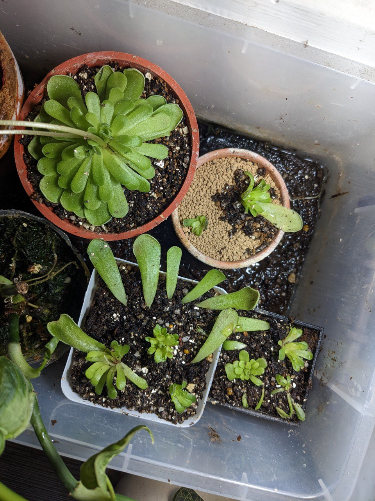
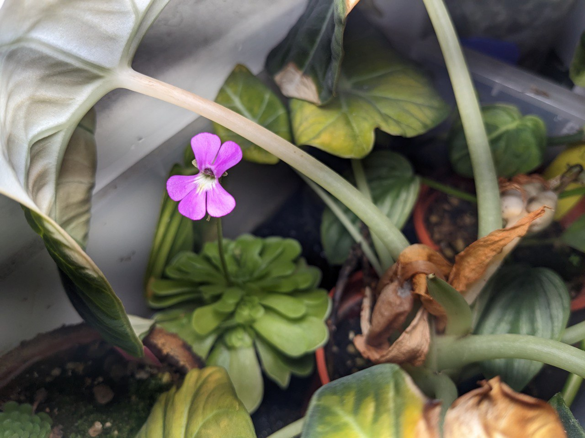
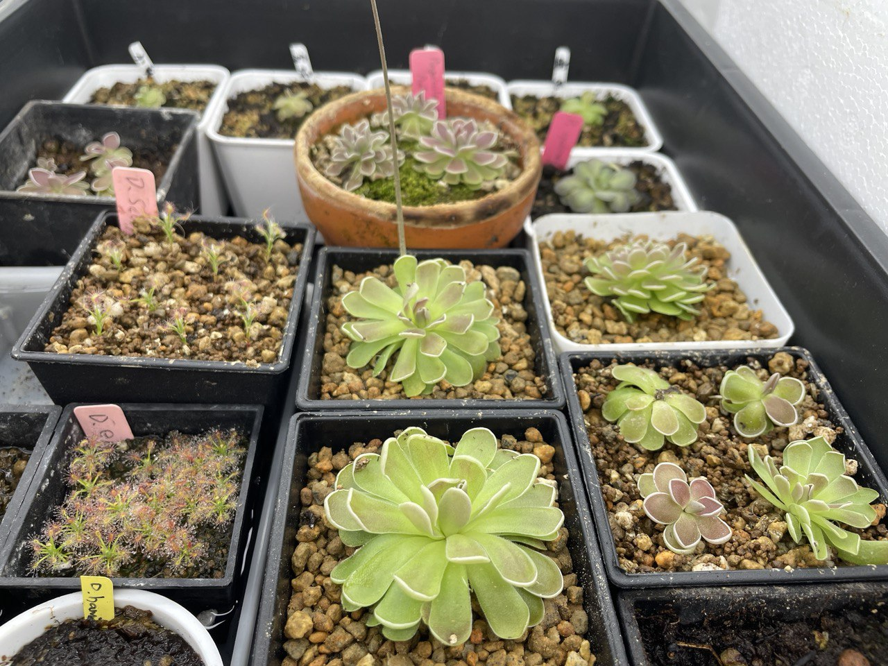
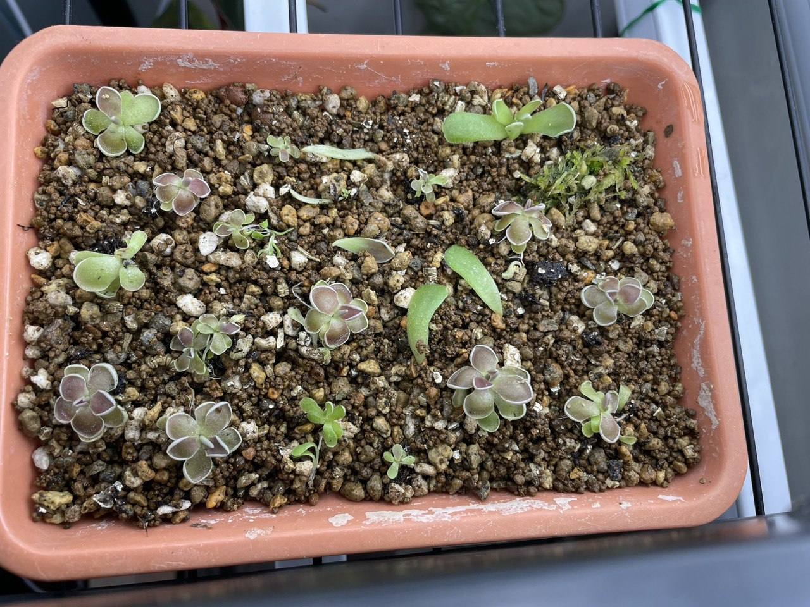
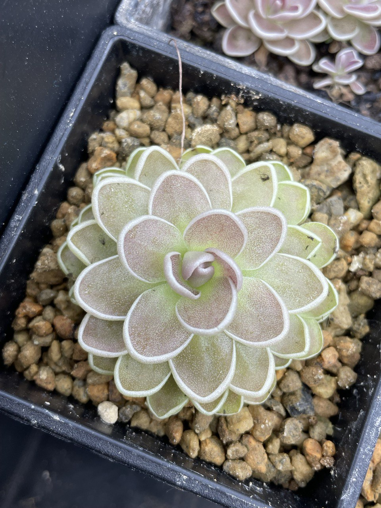
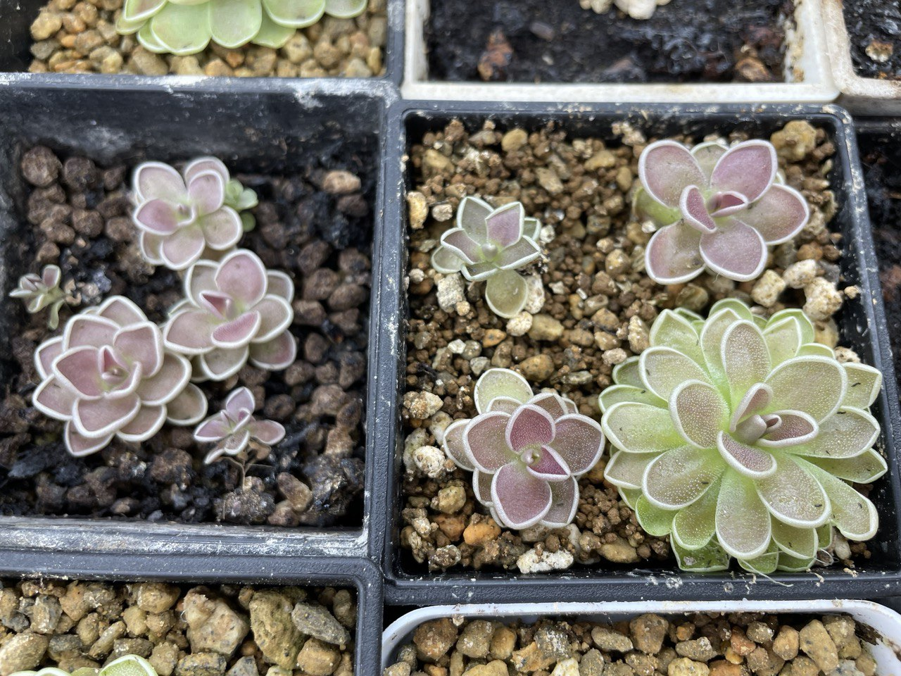
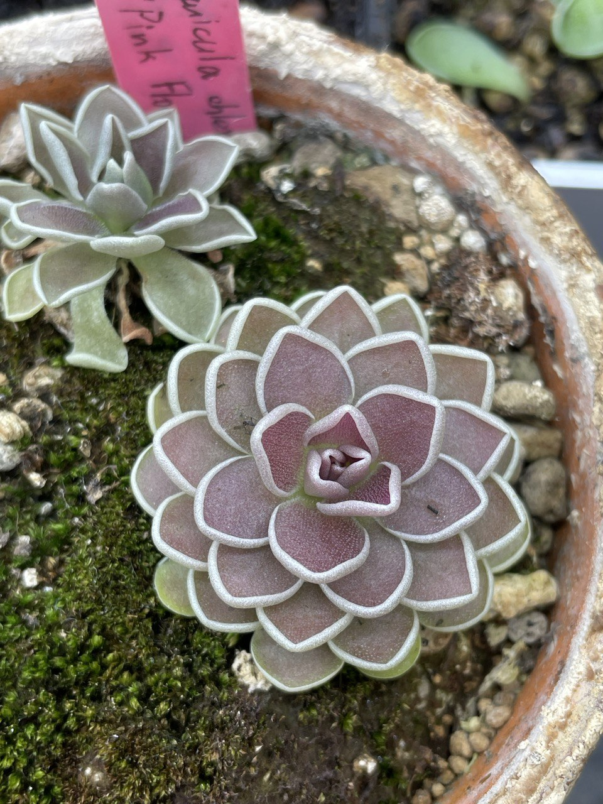
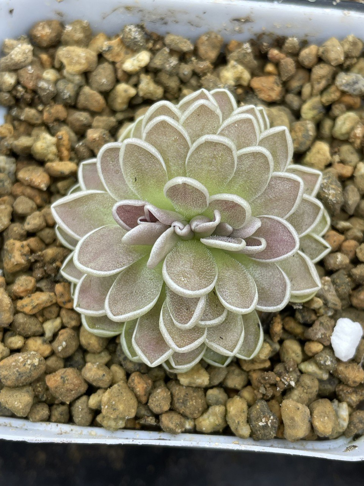

## 粉花愛勒氏捕蟲堇

中文名稱：粉花愛勒氏捕蟲堇  
學名及種源：*Pinguicula ehlersiae* { pink flw., Tolantonga, Hidalgo, Mex. }  
購入管道：[異草堂](https://www.facebook.com/peplants/?locale=zh_TW)  
購入價格：300 NTD

墨西哥系捕蟲堇。  
原產在亞熱帶高地，冬季會降雪，夏季溫度則像台灣的三至五月一樣溫和。  
有兩種型態的葉子。冬季短縮肥厚，不具捕蟲能力的的休眠葉；夏季稍微寬大，能分泌黏液的捕蟲葉。  

### 生長季

由於台灣夏季過於炎熱，潮濕的介質容易使植株腐敗，需要注意給水。  
在夜溫 20℃ 以下的生長季則可以腰水種植。  
墨西哥系捕蟲堇多攀附在薄薄的一層腐植質上，根系為鬚根。  
不需要太深的介質，搭配介質時以排水良好為基準。  

### 休眠季

冬季植株若沒有休眠，可考慮斷水誘發休眠，使植株隔年春季能夠開花。  
斷水時也要保持一定的空氣濕度。  

## 栽培紀錄

### 2022/08/01 入手

### 2023 二月

腰水種植中。開了粉紅色小花。  
光不足嚴重徒長，可看見捕蟲葉拉長並退回綠色。  
可能原始生長點受損導致側芽大量發生中。  
由於是休眠季，小苗的葉片是短縮肉質的休眠葉。
這樣下去不美觀，且生長勢可能變差，於是決定分株並把多餘的葉片拿去扦插。


  
  
  


### 2023 五月

找個地方弄了層架與燈管加強光照。  
因為開始進入夏天，怕植株腐敗而變成見乾見濕的給水。  
可看見小苗葉片型態已經變短且緊湊。看來光強度是適合的。  
原本的母株在生完小苗後生長停滯，所以看起來株型還是很鬆散。  
在光強度夠還有足夠的日夜溫差下，葉片也開始顯色。  


  
  


### 2023 六月

繁殖的小苗已經比肩當初購入的尺寸，呈色也很漂亮。  
雖然顏色都是偏紅，和剛買來的橘黃色差異還蠻大的。  
還得到一個綴化植株。  
這應該就是當時買來的母株，在生長點受損後產一堆小苗，最後演變成一排生長點的型態。  


  
  
  
  

