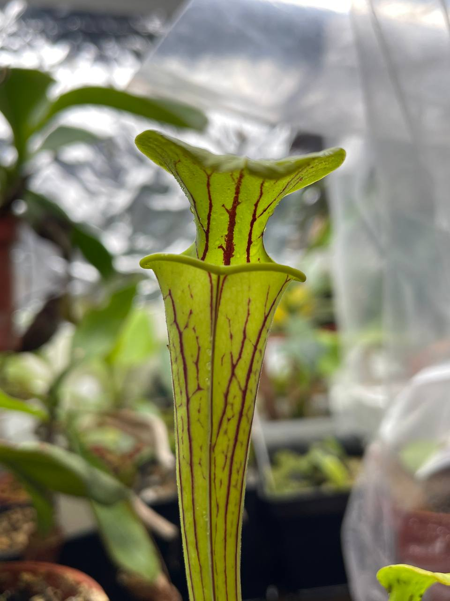
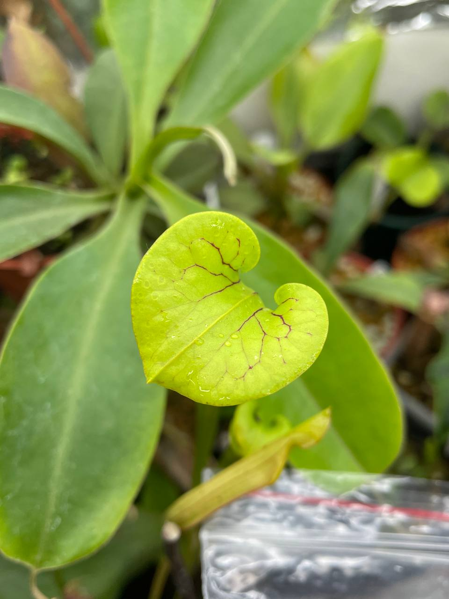
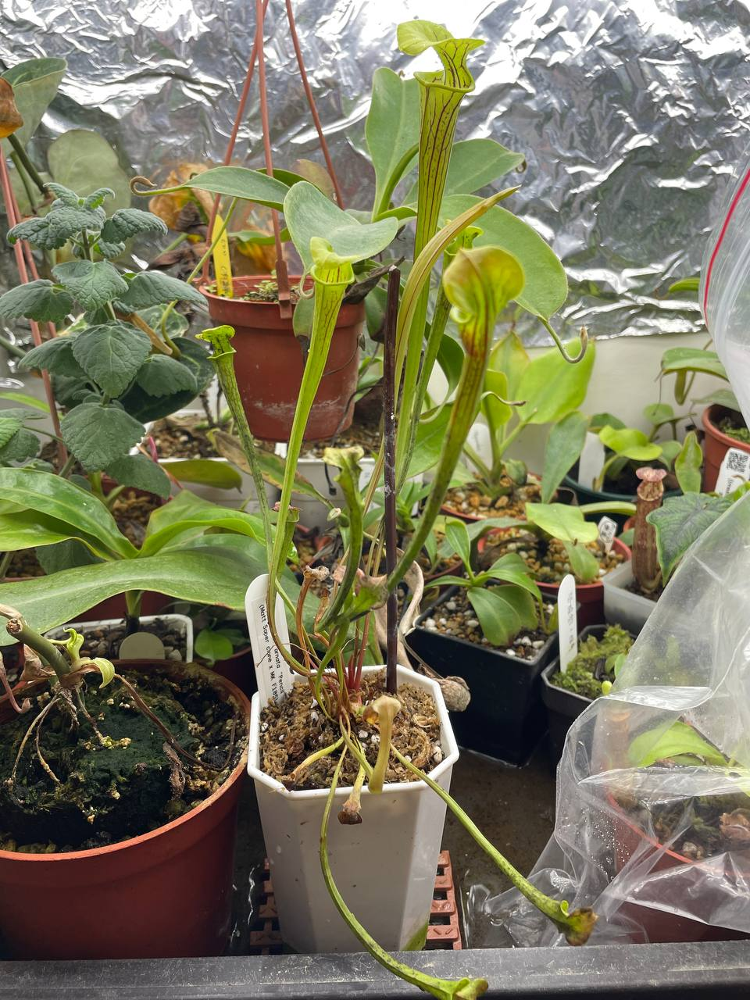

## 植物資料

")

中文名稱：黃瓶子草  
學名及種源：*Sarracenia flava* var. *ornata* "Pencil" (Matt Soper clone x MK F185)  
購入管道：[小蝕露台](https://www.facebook.com/littlebalconyofcarnivore/)  
購入價格：300 NTD  

縱向脈紋特別明顯的黃瓶子草個體。  

## 栽培紀錄

### 2023/12/13 入手

瓶子已經有觀賞性又大棵，太讚啦。


  
  
  

