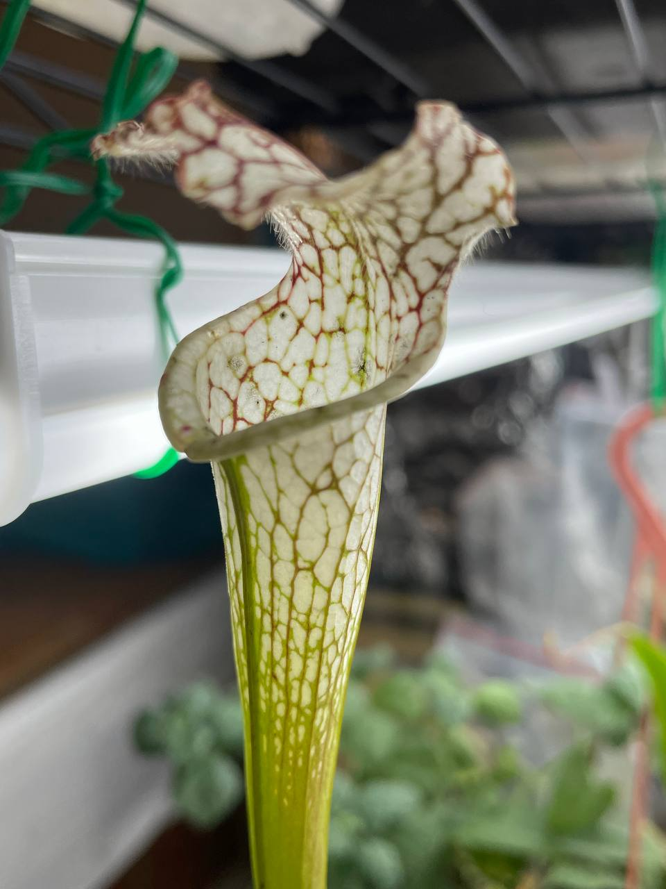
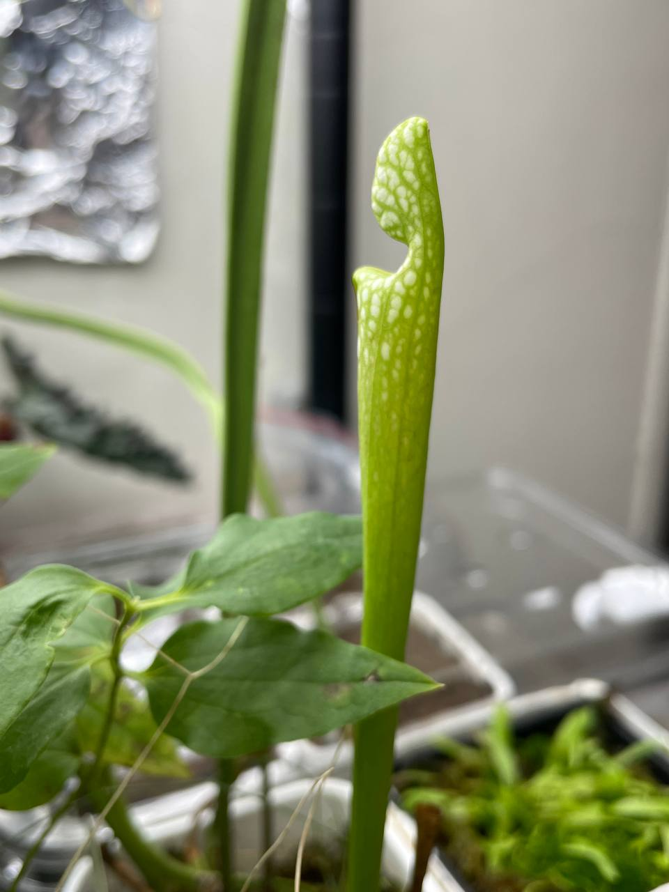

## 植物資料

 的父母本")

中文名稱：白網紋瓶子草  
學名及來源：*Sarracenia leucophylla* var. *alba* [CK x (Hurricane Creek White clone F x self)]  
購入管道：2023 台北食蟲植物交流會  
購入價格：200 NTD  

CK 的純白白網交颶風溪系列白網的實生苗。  
看到表現蠻喜歡且價格可接受，就買回來試試看。  

## 栽培紀錄

### 2023/11/04 入手

### 2023/12/06

