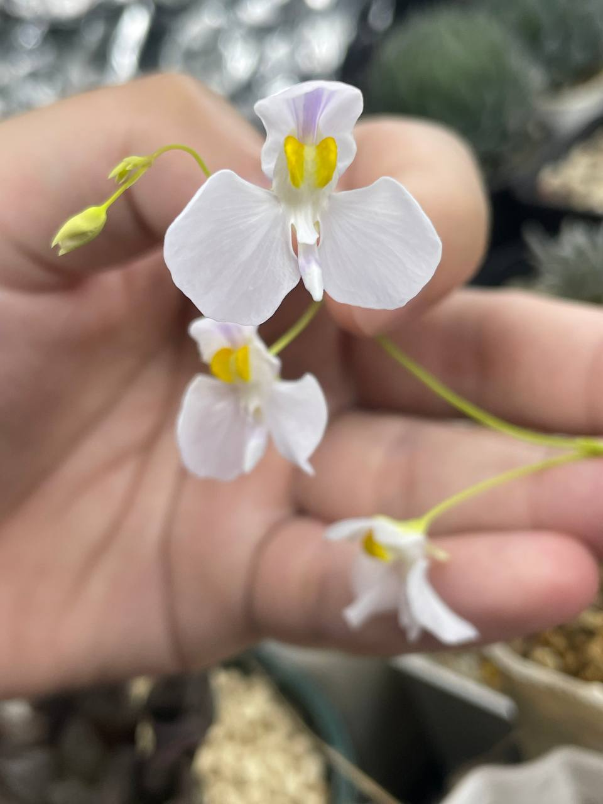
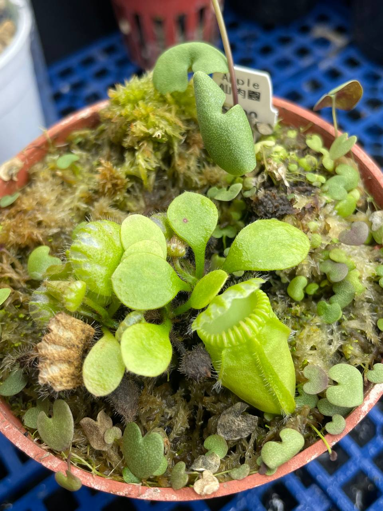

## 植物資料



中文名稱：愛心狸藻  
學名：*Utricularia nephrophylla* x *geminiloba*  
購入價格：200 NTD  

小腎葉狸藻交複裂狸藻，因愛心型的葉片而得名。  

## 栽培紀錄

### 2024/06/05 開花

5/19 時第一朵花盛開，盛開後約一個月後凋謝。  
第一朵花盛開後，花梗繼續抽長並發育新的花朵。  

目前手中只有這盆狸藻開花，尚不清楚狸藻開花條件，粗略將環境記錄在此，供參考。  
與土瓶草合植，介質使用水苔混合珍珠石。  
冬季室內種植，溫度會比室外稍高。  
夏季光週期約 10h，溫度約在 21-25℃。  


  
  

